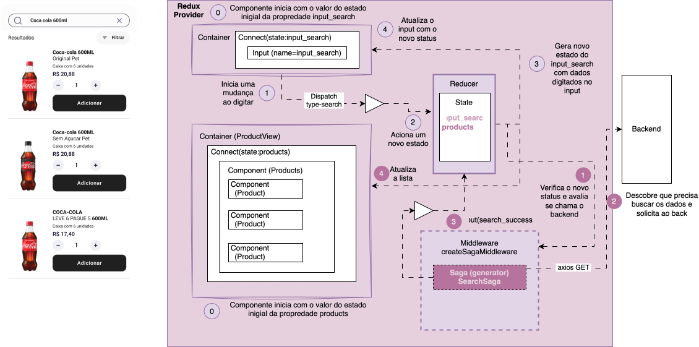

## Component Architecture

Arquitetura baseada em componentes reutilizáveis, com separação clara entre UI e lógica orientada a domínio (DDD-friendly).

### Estrutura padrão de diretórios

```
my-app/  
|── src/  
|   |── layout/                 # Estrutura de organização central da UI  
│       ├── themes/             #   
│   ├── components/             # Componentes genéricos com suporte a Storybook  
│   ├── domains/                #   
│       ├── auth/               #  
│           ├── components/     # Componentes genéricos do domínio  
│           ├── screens/        # Views do domínio  
│               ├── login/      # View especifica de navegação  
│                 ├── Login.tsx # Componente desconectado de apresentação   
│                 └── index.tsx # View Container conectado ao store e navegação  
│               ├── signin/     # View especifica de navegação  
│           ├── hooks/          # Hooks que fazems entido no domain  
│           ├── index.tsx       # Container do domínio  
│       ├── checkout/           #   
│       ├── home/               #   
│       └── products/           #   
│   ├── navigation/            # Mapa de navegação do App  
│   ├── store/                 # Redux, reducers e sagas  
│       ├── domains/           # Sagas e reducers específicos por Bounded Context
│       ├── services/          # API (Utilizando o Axios)  
│       ├── database/          # WatermelonDB setup quando Offline é necessário  
│   ├── hooks/                 # Hooks globais personalizados  
│   ├── i18n/                  # Internacionalização  
│   ├── styles/                # Estilos (Tailwind / NativeWind)  
│   ├── assets/                # Estilos (Tailwind / NativeWind)  
│   ├── utils/                 # Utils, helpers e tipos globais  
│   └── App.tsx                # Entry point  
├── .storybook/                # Configuração do Storybook  
├── android/                   # Build Android (React Native)  
├── ios/                       # Build iOS (React Native)  
├── package.json  
└── README.md  
```

### Container / Presentational (Smart / Dumb Components)

Separar a lógica (Container) da UI (Presentational).

#### Componentes conectados

Componentes que encapsulam a conexão com o estado transacional de navegação e manipulação dos dados.

```
export default function PrimarySearchAppBar() {
  const dispatch = useDispatch();
  const store: CustomStore = useStore() as CustomStore;
  useEffect(function registerSaga() {
    const task = store.run(rootSaga);
    return () => {
      if (task) {
        task.cancel();
      }
    }
  }, [store]);
  const searchInputValue: string = useSelector(selector) || '';
  const actions = productActions(dispatch);
  const onChangeText = actions.onChangeTypeSearch;
  const onChange = (event: React.ChangeEvent<HTMLInputElement>) => {
    onChangeText(event.target.value);
  }
  return (/* Estrutura do componente */)
}
```

#### Componentes de apresentação documentados via Storybook

Componentes que representam a UI das funcionalidades e não dependem do estado transacional, encapsulam toda sua utilização.

```
// Button.tsx
export const Button = ({ label, onClick }) => (
  <button className="bg-blue-500 text-white py-2 px-4 rounded" onClick={onClick}>
    {label}
  </button>
);

// Button.stories.tsx
import { Button } from './Button';

export default { title: 'Components/Button', component: Button };

export const Primary = () => <Button label="Clique aqui" onClick={() => alert('Oi!')} />;
```

### Domain Driven UI

Organizar componentes e containers por domínio funcional em vez de tipo de componente.

### Hooks Pattern (Stateful Logic Isolation)

Extrair lógica de estado para um hook reutilizável.

```
// useCounter.ts
import { useState } from 'react';

export function useCounter() {
  const [count, setCount] = useState(0);
  const increment = () => setCount(c => c + 1);
  return { count, increment };
}
```

```
// CounterComponent.tsx
import { useCounter } from './useCounter';

export default function CounterComponent() {
  const { count, increment } = useCounter();
  return (
    <View>
      <Text>{count}</Text>
      <Button onPress={increment} title="+" />
    </View>
  );
}
```

## State Management

Gerenciamento de estado global/local desacoplado da UI, com suporte a assincronia e persistência. Preferência por hooks e reatividade.

O ecossistema Redux fornece uma base sólida para controle transacional, validações e observabilidade em aplicações complexas. Sua estrutura baseada em fluxo unidirecional de dados e ações declarativas facilita:  
	•	Controle transacional: Ao centralizar as mutações de estado em reducers puros e previsíveis, Redux permite que operações críticas sejam encapsuladas em fluxos consistentes e auditáveis — especialmente quando combinadas com middlewares como redux-saga para orquestração assíncrona.  
	•	Validação estática e dinâmica: A tipagem explícita de ações e estados (com TypeScript) fornece validação estática robusta. Adicionalmente, middlewares e sagas permitem inserir camadas de validação dinâmica no momento do despacho ou processamento de ações, antes que qualquer mutação de estado ocorra.  
	•	Interceptação e Observabilidade: Redux oferece pontos de extensão naturais (como middlewares, enhancers e sagas) que permitem interceptar, registrar e monitorar todas as ações que fluem pela aplicação. Isso facilita a integração com ferramentas como Sentry, LogRocket, Datadog ou sistemas de auditoria interna, gerando rastreabilidade e métricas de uso em tempo real.  

Essa centralização do fluxo de dados e eventos torna o Redux não apenas uma ferramenta de gerenciamento de estado, mas um pilar fundamental para arquitetura orientada a domínio, segurança, rastreabilidade e confiabilidade operacional.




### Criação de Store personalizado com flexibilidade para delegar aos domínios a utilização de Sagas

```

import { applyMiddleware, Store, Observable, Reducer, Dispatch, legacy_createStore } from 'redux';
import createSagaMiddleware, { Saga, SagaMiddleware, Task } from 'redux-saga';
import { composeWithDevTools } from '@redux-devtools/extension';
import createReducer from './Reducer';
import { Router } from '@remix-run/router';
import { GlobalAction } from './actions';
import { GlobalState } from './state';
import NewRelicAgent from './newrelic';
import { rootSaga } from './sagas/newrelic';
import axios from './server';

// Interface para facilitar a criação de um Store personalizado que combina características do Middleware de Sagas
interface StoreWithSagas {
    run<S extends Saga>(saga: S, ...args: Parameters<S>): Task
}

// Store customiza que herda todo o comportamento de um Store padrão do tipo Legacy com o controle de adicionar Saga sob demanda e desativar quando necessário
export default class CustomStore implements Store<GlobalState, GlobalAction>, StoreWithSagas {
    private store: Store<GlobalState, GlobalAction>;
    private sagaMiddleware: SagaMiddleware;
  
    // Recebe o router para utilizar a navegação quando necessário a partir de seu contexto, é útil em uma saga quando precisa direcionar a navegação
    constructor(router: Router) {
        this.sagaMiddleware = createSagaMiddleware({
          context: {
            axios, //adicionar o Axios para centralizar a captura e evitar import nos arquivos
            newRelicAgent: NewRelicAgent(),
          }
        });
        //Preferencia pelo modelo de sagas
        this.sagaMiddleware.setContext({ router });
        const middlewares = [
          this.sagaMiddleware
        ];
        const reducer = createReducer();
        this.store = legacy_createStore(
            reducer, 
            composeWithDevTools(applyMiddleware(...middlewares))
        );

        if (import.meta.env.VITE_ENABLE_NEWRELIC == 1) {
          this.sagaMiddleware.run(rootSaga);
        }
        
    }

    run<S extends Saga>(saga: S, ...args: Parameters<S>): Task {
        return this.sagaMiddleware.run(saga, ...args);
    }
  
    [Symbol.observable](): Observable<GlobalState> {
      return this.store[Symbol.observable]();
    }
  
    getState = (): GlobalState => {
      return this.store.getState();
    }

    dispatch: Dispatch<GlobalAction> = (action) => this.store.dispatch(action);  
  
    subscribe = (listener: () => void): () => void => {
      return this.store.subscribe(listener);
    }
  
    replaceReducer = (nextReducer: Reducer<GlobalState, GlobalAction>)  => {
      this.store.replaceReducer(nextReducer);
    }
}

```

### Preferência pelo modo Legacy do Redux

O modelo tradicional do Redux incentiva o uso do combineReducers, o que impõe uma estrutura de isolamento rígido do estado para cada entidade ou domínio. Esse formato fragmenta a árvore de estado, dificultando a manipulação coordenada de múltiplos domínios — especialmente em cenários onde sagas e reducers precisam interagir com diferentes partes do estado pertencentes a seus respectivos Bounded Contexts.

Por outro lado, o padrão original do Flux e do Redux foi concebido com a ideia de um único estado global que reflete a árvore de componentes da aplicação. Nessa abordagem, a função reducer é responsável por transformar o estado como um todo, a partir das ações recebidas.

Adotamos, portanto, um modelo mais flexível, onde a manipulação do estado global é delegada a módulos de domínio responsáveis por processar ações específicas. Utilizamos uma convenção baseada em action.meta para rotear ações e permitir que reducers especializados atuem sobre o estado completo, sem as limitações impostas pelo combineReducers. Isso oferece maior liberdade arquitetural e facilita a composição entre domínios no contexto de aplicações mais complexas.

```

import { GlobalAction, THEME_SWITCH } from "./actions";
import { GlobalState, initialGlobalState } from "./state";

export default function createReducer() {

  return (state: GlobalState = initialGlobalState, 
    action: GlobalAction): GlobalState => {

    // Tratamento de ações globais
    if (action.type === THEME_SWITCH) {
      return {
        ...state, 
        darkMode: state.darkMode == 'dark' ? 'light': 'dark',
      }
    }
    // Execução enviada pelo módulo no Domain 
    if (action?.meta?.reducer) {
      return action.meta.reducer(state, action);
    }

    return state;
  };
}

```

### Utilização do Redux em cada Bounded Context

Capacidade de acoplar ou desacoplar sagas conforme utilização do domínio.

```
import CustomStore from '@webshop-store';

import rootSearchSaga from '@webshop-store/domains/home/search';
import { useEffect } from 'react';

export default function PrimarySearchAppBar() {
  const dispatch = useDispatch();
  const store: CustomStore = useStore() as CustomStore;
  useEffect(function registerSaga() {
    // Adiciona a saga sob demanda, não precisa iniciar todas no boot da aplicação
    const task = store.run(rootSearchSaga);
    return () => {
      if (task) {
        // Quando sair do módulo, desativa as sagas utilizadas
        task.cancel();
      }
    }
  }, [store]);
  const searchInputValue: string = useSelector(selector) || '';
  const actions = productActions(dispatch);
  const onChangeText = actions.onChangeTypeSearch;
  const onChange = (event: React.ChangeEvent<HTMLInputElement>) => {
    onChangeText(event.target.value);
  }
  return (/* Estrutura do componente */)
}
```

## Navigation & Routing

Utilização de React Router para uso em repos Web e React Navigation para projetos React Native.

As rotas são declaradas como uma árvore de objetos, promovendo uma navegação aninhada e organizada por layout. Um componente LayoutBase para atuar como um contêiner comum que envolve todas as páginas filhos da aplicação. A estrutura de rotas definida contempla dois caminhos principais:

```
export const router = createBrowserRouter([
  {
    path: "/",
    Component: LayoutBase,
    children: [
      {
        index: true,               // Rota raiz "/"
        Component: Home,
      },
      {
        path: "checkout",          // Rota "/checkout"
        Component: CheckoutScreen,
      }
    ],
  },
]);
```

### Composição das Rotas  
	•	LayoutBase: Componente de layout pai responsável por renderizar uma estrutura comum (como header, footer ou menus) compartilhada por todas as páginas filhas.  
	•	Home: Página exibida na rota raiz ("/").  
	•	CheckoutScreen: Exemplo de página raiz de um Bounded Context renderizada ao acessar "/checkout".  

A propriedade index: true define que Home será o componente padrão renderizado dentro do LayoutBase na raiz da aplicação.

### Inicialização do Roteador  
O roteador é inicializado com o componente RouterProvider, que recebe a instância de roteador criada: 
```
const RouterProviderImpl = () => (
  <RouterProvider router={router} />
);

export default RouterProviderImpl;
```

Esse componente deve ser incluído na árvore de renderização principal da aplicação (geralmente em App.tsx ou main.tsx) para habilitar a navegação entre páginas com base nas rotas declaradas. 

### Vantagens do modelo adotado  

#### Separação clara entre layout e conteúdo  
O uso de children permite aplicar layouts reutilizáveis sem replicar código estrutural entre páginas.
#### Escalabilidade  
A estrutura facilita a adição de novas rotas e sub-rotas com layouts específicos conforme o crescimento da aplicação.  
#### Compatibilidade com navegação declarativa
Permite o uso de componentes como <Link /> e hooks como useNavigate() e useLocation() para navegação e controle programático de rotas.  


### Sugestões de extensão  
	•	Incluir tratamento de rotas privadas com componentes de ProtectedRoute.  
	•	Adicionar uma rota 404 para capturar acessos inválidos.  
	•	Suportar lazy loading com React.lazy e Suspense para otimizar o carregamento de páginas.  


## Form Handling & Validation

A manipulação de formulários deve ser feita com bibliotecas como React Hook Form integradas com Zod para validação declarativa. Isso garante validação tanto estática quanto dinâmica, e ótima performance por controlar os inputs via refs.

```
const schema = z.object({
  email: z.string().email(),
  password: z.string().min(6),
});
const { register, handleSubmit, formState } = useForm({ resolver: zodResolver(schema) });
```

## API Communication

A comunicação com APIs é realizada com Axios, encapsulado em serviços por domínio. As requisições assíncronas são orquestradas por Redux-Saga, permitindo tratamento de fluxo, cancelamento e controle transacional.

```
function* fetchUser() {
  try {
    const { data } = yield call(api.get, '/user');
    yield put({ type: 'USER_SUCCESS', payload: data });
  } catch (error) {
    yield put({ type: 'USER_ERROR', error });
  }
}
```

## Authentication & Session

A autenticação pode ser gerenciada com Redux + Sagas para login/logout, tokens salvos via localStorage ou SecureStore. O middleware pode interceptar ações como LOGIN_SUCCESS para persistir sessão e redirecionar.

```
function* loginSaga({ payload }) {
  const { data } = yield call(api.post, '/login', payload);
  yield put({ type: 'LOGIN_SUCCESS', payload: data });
}
```

## Offline & Sync (Mobile)

Para React Native, use WatermelonDB ou MMKV para persistência local. A sincronização pode ser feita com Redux-Saga, coordenando fetch local e remoto de dados com base em timestamps ou marcações de dirty state.

## Animations & Gestures

Para mobile, use Reanimated + React Native Gesture Handler. Em web, opte por Framer Motion para animar rotas e transições com base em estado global do Redux ou no próprio React Router DOM.

## Code Splitting & Optimization

Utilize React.lazy e Suspense para code splitting, permitindo carregamento sob demanda de rotas ou domínios inteiros. Reduza o tamanho do bundle com dynamic imports e evite carregar dependências globais desnecessárias.

```
const CheckoutScreen = lazy(() => import('../views/checkout/Checkout'));
```

## Monorepo & Modularização

Adote o padrão Domain/Bounded Contexts, organizando o projeto por domínios com pnpm workspaces ou Nx para controlar dependências internas. Cada domínio pode exportar hooks, componentes e reducers isoladamente.

```
packages/
├── auth/
├── checkout/
└── shared/
```

## Testing
	•	Unitários com Jest (reducers, sagas, serviços)
	•	Componentes com React Testing Library
	•	E2E com Detox (mobile) ou Cypress (web)
	•	Mocks com MSW (Mock Service Worker)

## Error Monitoring

Sentry é integrado via middleware Redux + React Error Boundary para capturar exceções globais, erros assíncronos em sagas e erros de UI.

```
Sentry.captureException(error);
```

## Offline-First com WatermelonDB no React Native

### Visão Geral

WatermelonDB é uma base de dados local altamente performática e reativa, desenhada especificamente para aplicativos mobile com grande volume de dados e requisitos offline-first. Ao contrário de soluções simples de armazenamento (como AsyncStorage ou SQLite direto), o WatermelonDB fornece:  
	•	Relacionamentos normalizados entre entidades  
	•	Reatividade nativa com observáveis  
	•	Sincronização eficiente com back-end  
	•	Suporte a estrutura de dados complexa  

```
src/
├── database/
│   ├── schema.js              # Esquema das tabelas
│   ├── models/                # Modelos ORM (User, Post, etc)
│   ├── database.js            # Instância do banco
│   └── sync/                  # Estratégia de sincronização

```


### Exemplo de Schema e Model

```
import { appSchema, tableSchema } from '@nozbe/watermelondb';

export const mySchema = appSchema({
  version: 1,
  tables: [
    tableSchema({
      name: 'tasks',
      columns: [
        { name: 'title', type: 'string' },
        { name: 'is_completed', type: 'boolean' },
      ],
    }),
  ],
});
```


```
import { Model } from '@nozbe/watermelondb';
import { field } from '@nozbe/watermelondb/decorators';

export default class Task extends Model {
  static table = 'tasks';

  @field('title') title;
  @field('is_completed') isCompleted;
}
```

### Instância do banco

```
import { Database } from '@nozbe/watermelondb';
import SQLiteAdapter from '@nozbe/watermelondb/adapters/sqlite';
import { mySchema } from './schema';
import Task from './models/Task';

const adapter = new SQLiteAdapter({ schema: mySchema });

export const database = new Database({
  adapter,
  modelClasses: [Task],
});
```

### Sincronização com o servidor

WatermelonDB não impõe uma estratégia de sincronização, o que te dá liberdade total. A prática comum é usar um middleware como Redux-Saga ou um worker manual que:  
	1.	Envia os registros locais para o servidor (push).  
	2.	Baixa as mudanças novas (pull).  
	3.	Aplica dentro de uma transação atômica.  

```
import { synchronize } from '@nozbe/watermelondb/sync';

export async function syncWithServer(database) {
  await synchronize({
    database,
    pullChanges: async ({ lastPulledAt }) => {
      const response = await fetch(`https://api.exemplo.com/sync/pull?lastPulledAt=${lastPulledAt}`);
      const result = await response.json();
      return {
        changes: result.changes,
        timestamp: result.timestamp,
      };
    },
    pushChanges: async ({ changes, lastPulledAt }) => {
      await fetch('https://api.exemplo.com/sync/push', {
        method: 'POST',
        body: JSON.stringify({ changes, lastPulledAt }),
      });
    },
  });
}
```


## Design System Integration

Use Storybook para documentar componentes isoladamente e aplicar testes visuais com Chromatic ou Ladle. Componentes shared podem consumir tokens de design centralizados.  

O ideal é utilizar templates já prontos com Material Design como:  
https://github.com/codedthemes/berry-free-react-admin-template
