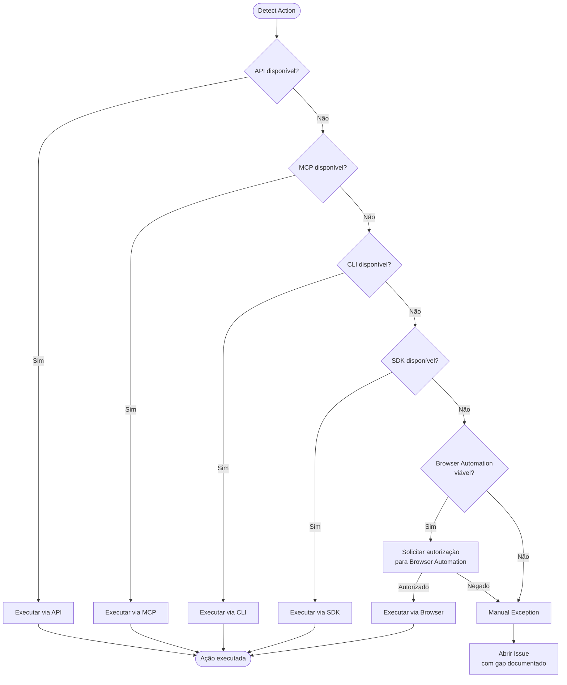

# Automation First

**Princípio 8 do ProdOps Framework.**

---

## Definição

Um agente deve sempre tentar executar uma ação ele mesmo antes de instruir um humano a fazê-la. Intervenção manual é último recurso — uma **Manual Exception** documentada — nunca o caminho padrão.

---

## Filosofia

A pergunta que o agente deve fazer a si mesmo diante de qualquer ação é:

> **"Eu consigo executar isso?"** — não "Como explico para o humano executar?"

O agente é o executor primário. O humano é acionado apenas quando todas as possibilidades de automação foram demonstravelmente esgotadas.

---

## Ordem Canônica de Tentativas

Antes de declarar que uma ação requer intervenção humana, o agente percorre a seguinte sequência em ordem:

| Prioridade | Mecanismo | Condição de uso |
|---|---|---|
| 1 | **API** | Endpoint REST ou GraphQL disponível para a ação |
| 2 | **MCP** | Ferramenta MCP disponível que realiza a ação |
| 3 | **CLI** | Ferramenta de linha de comando (ex: `gh`, `curl`, `jq`) |
| 4 | **SDK** | SDK disponível na sessão (ex: Octokit, Anthropic SDK) |
| 5 | **Browser Automation** | Nenhum dos anteriores funciona; ação é realizável via UI |
| — | **Manual Exception** | Todas as opções acima foram tentadas e falharam |

Cada nível da sequência deve ser **tentado**, não apenas avaliado teoricamente. O agente executa e captura o erro. "Não sei se funciona" não é justificativa para pular um nível.

---

## Fluxo de Decisão



---

## Manual Exception

Uma **Manual Exception** é uma exceção operacional documentada: a ação não pode ser automatizada no contexto atual por limitação demonstrável da plataforma ou do ambiente.

### Quando se aplica

- API retorna erro definitivo (ex: 404 em endpoint que não suporta a operação, ausência de mutation no GraphQL).
- Nenhuma ferramenta MCP, CLI ou SDK consegue realizar a ação.
- Browser Automation foi solicitado e negado pelo usuário.

### Requisitos obrigatórios

1. **Abrir um Issue de rastreamento** com:
   - Título: `infra: <descrição da limitação>`
   - Labels: `operation:provision`, `journey:diligence` (ou as labels pertinentes ao contexto)
   - Corpo: erro de API capturado, o que foi tentado, critério de resolução
2. **Registrar no Conformance Report** na seção "Known Platform Limitations".
3. **Nunca deixar como texto flutuante** — a instrução não vai no output do agente; vai no corpo do Issue.

### O que NÃO é Manual Exception

- "Não tentei a API mas acho que não funciona."
- "A UI é mais rápida."
- "O usuário pode fazer mais facilmente."

---

## Browser Automation

Quando API, MCP, CLI e SDK estão esgotados mas a ação é realizável via UI, o agente deve:

1. **Identificar** que Browser Automation é o próximo passo da sequência canônica.
2. **Solicitar autorização** ao usuário para executar via Browser Automation.
3. **Nunca dizer "faça você mesmo"** — sempre propor executar.
4. Registrar na seção "Automation Opportunities" do Conformance Report enquanto aguarda autorização.

Exemplo de linguagem correta:

> "Posso executar a remoção das views extras utilizando Browser Automation. Deseja que eu execute?"

---

## Nunca Fazer

As frases abaixo são proibidas em output de agentes — a menos que todas as opções de automação tenham sido demonstravelmente esgotadas e documentadas:

- "Faça manualmente…"
- "Acesse a UI…"
- "Clique em…"
- "Vá até…"
- "Configure…"
- "Remova manualmente…"
- "Configure manualmente na UI…"
- "Ação manual obrigatória"
- "Pendente manual"

Se qualquer uma dessas frases aparecer no output sem um trail explícito de tentativas de automação + Issue aberto, é uma violação do Princípio 8.

---

## Formato de Conformance Report (estado desejado)

Quando o Reconcile é executado e não há Workspace Drift, ou quando há limitações de plataforma documentadas, o Conformance Report ideal segue este formato:

```
## Workspace Reconciliation

**Status:** CONFORME

### Workspace Drift
Nenhum — Desired state satisfied. No reconciliation actions required.

### Reconciliation Actions
Nenhuma — No reconciliation actions required.

### Automation Opportunities
- Remover "View 1" — aguardando autorização para Browser Automation
- Remover "test-view-api" — aguardando autorização para Browser Automation

### Known Platform Limitations
- GitHub API não suporta configuração de `group_by` em views (REST PATCH → 404, GraphQL sem mutation)

### Próxima Ação
Posso executar a limpeza das views extras utilizando Browser Automation. Deseja que eu execute?
```

**Nota sobre "Desired State":** quando não há Workspace Drift, o agente reporta "Desired state satisfied. No reconciliation actions required." — nunca "Reconcile skipped." A distinção importa: "skipped" implica que havia trabalho que foi omitido; "desired state satisfied" confirma que o estado é o correto.

---

## Cross-references

→ [Principles](principles.md) — lista canônica de princípios do framework (Princípio 8)
→ [Workspace Reconciliation capability](journeys/diligence/workspace-reconciliation.md) — contexto de aplicação primária
→ [Reconcile SKILL](../skills/diligence/workspace-reconciliation/steps/reconcile/SKILL.md) — implementação do passo Reconcile
→ [Verify SKILL](../skills/diligence/workspace-reconciliation/steps/verify/SKILL.md) — Conformance Report
→ [GitHub Workspace](github-workspace.md) — Known Platform Limitations documentadas
