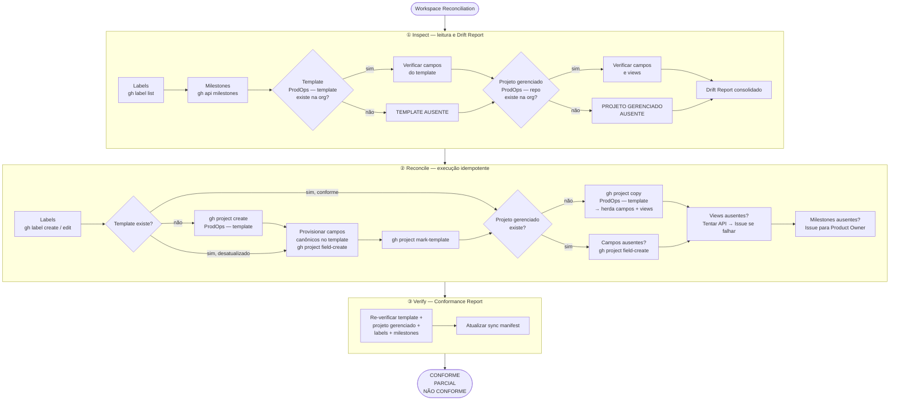

# GitHub Workspace — Canonical Specification

Este arquivo é a Canonical Specification da infraestrutura do GitHub Workspace do produto. O step `inspect` da capability `workspace-reconciliation` lê este arquivo e compara com o Actual Workspace (estado real do repositório via API) para detectar Workspace Drift.

---

## Fluxo de Workspace Reconciliation

A capability `workspace-reconciliation` lê esta Canonical Specification e a compara com o Actual Workspace para detectar Workspace Drift, reconciliar divergências e produzir um Conformance Report.



---

## Labels

### Família: operation

| Label | Cor | Descrição |
|---|---|---|
| `operation:capture` | `#0075ca` | ProdOps operation: Capture |
| `operation:create` | `#0075ca` | ProdOps operation: Create |
| `operation:define` | `#0075ca` | ProdOps operation: Define |
| `operation:refine` | `#0075ca` | ProdOps operation: Refine |
| `operation:update` | `#0075ca` | ProdOps operation: Update |
| `operation:prototype` | `#0075ca` | ProdOps operation: Prototype |
| `operation:review` | `#0075ca` | ProdOps operation: Review |
| `operation:approve` | `#0075ca` | ProdOps operation: Approve |
| `operation:validate` | `#0075ca` | ProdOps operation: Validate |
| `operation:split` | `#0075ca` | ProdOps operation: Split |
| `operation:merge` | `#0075ca` | ProdOps operation: Merge |
| `operation:promote` | `#0075ca` | ProdOps operation: Promote |
| `operation:implement` | `#0075ca` | ProdOps operation: Implement |
| `operation:experiment` | `#0075ca` | ProdOps operation: Experiment |
| `operation:release` | `#0075ca` | ProdOps operation: Release |
| `operation:archive` | `#0075ca` | ProdOps operation: Archive |
| `operation:deprecate` | `#0075ca` | ProdOps operation: Deprecate |
| `operation:discard` | `#0075ca` | ProdOps operation: Discard |
| `operation:cancel` | `#0075ca` | ProdOps operation: Cancel |
| `operation:provision` | `#0075ca` | ProdOps operation: Provision |

### Família: artifact-type

| Label | Cor | Descrição |
|---|---|---|
| `artifact-type:business-signal` | `#e4e669` | ProdOps artifact type: Business Signal |
| `artifact-type:business-intent` | `#e4e669` | ProdOps artifact type: Business Intent |
| `artifact-type:global-obc` | `#e4e669` | ProdOps artifact type: Global OBC |
| `artifact-type:local-obc` | `#e4e669` | ProdOps artifact type: Local OBC |
| `artifact-type:bdd-feature` | `#e4e669` | ProdOps artifact type: BDD Feature |
| `artifact-type:architecture` | `#e4e669` | ProdOps artifact type: Architecture |
| `artifact-type:iteration-plan` | `#e4e669` | ProdOps artifact type: Iteration Plan |
| `artifact-type:reliability-plan` | `#e4e669` | ProdOps artifact type: Reliability Plan |
| `artifact-type:release-trail` | `#e4e669` | ProdOps artifact type: Release Trail |
| `artifact-type:experiment` | `#e4e669` | ProdOps artifact type: Experiment |
| `artifact-type:evidence` | `#e4e669` | ProdOps artifact type: Evidence |
| `artifact-type:risk-register` | `#e4e669` | ProdOps artifact type: Risk Register |
| `artifact-type:context-capsule` | `#e4e669` | ProdOps artifact type: Context Capsule |

### Família: journey

| Label | Cor | Descrição |
|---|---|---|
| `journey:discovery` | `#d93f0b` | ProdOps journey: Discovery |
| `journey:assessment` | `#d93f0b` | ProdOps journey: Assessment |
| `journey:delivery` | `#d93f0b` | ProdOps journey: Delivery |
| `journey:operation` | `#d93f0b` | ProdOps journey: Operation |
| `journey:diligence` | `#d93f0b` | ProdOps journey: Diligence |

---

## Milestones

Milestones representam releases do produto. Criados pelo Product Owner antes de cada iteração.

| Milestone | Descrição |
|---|---|
| `v{major}.{minor}` | Release do produto — agrupa Issues da iteração correspondente |

Milestones são gerenciados pelo Product Owner — não são provisionados automaticamente pelo Diligence.

---

## GitHub Projects — Dois projetos gerenciados

O framework mantém **dois** GitHub Projects na org, ambos identificados por nome (nunca por número):

| Papel | Nome | Escopo |
|---|---|---|
| Template canônico | `ProdOps — template` | Org — source para `gh project copy` |
| Projeto gerenciado | `ProdOps — <repo-name>` | Por repositório — ex: `ProdOps — payments-api` |

**Projetos manuais são intocáveis.** Qualquer projeto cujo nome não corresponda a um desses dois padrões é ignorado pelo Diligence — inclusive projetos criados antes do framework (ex: "Turma Junho 2026").

### ProdOps — template (org-level)

Projeto marcado como template via `gh project mark-template`. Contém todos os campos canônicos e as views canônicas. Serve como source de `gh project copy` ao criar projetos gerenciados para novos repositórios.

**Quando criar:** na primeira execução de `workspace-reconciliation reconcile` se ainda não existir.
**Criação:**
```bash
gh project create --owner <org> --title "ProdOps — template"
gh project edit <number> --owner <org> --visibility PUBLIC   # público por default
```
**Após criar:** provisionar campos canônicos via API, criar views via REST, então `gh project mark-template`.
**Visibilidade:** PUBLIC por default. Alterar para PRIVATE somente com diretiva explícita.

### ProdOps — \<repo-name\> (por repositório)

Projeto criado via `gh project copy "ProdOps — template"`, herdando campos e views automaticamente.

**Quando criar:** quando o projeto gerenciado do repositório não existir.
**Criação:**
```bash
gh project copy <template-number> \
  --source-owner <org> --target-owner <org> \
  --title "ProdOps — <repo-name>"
gh project edit <number> --owner <org> --visibility PUBLIC   # público por default
```
**Pré-requisito:** o template deve existir e estar configurado antes da cópia.
**Visibilidade:** PUBLIC por default. `gh project copy` herda a visibilidade do source — verificar e corrigir após cópia se necessário.

**Vínculo com o repositório (obrigatório, não automático):** `gh project copy` copia campos e views mas **não** vincula o projeto ao repositório. Executar imediatamente após a cópia:
```bash
gh api graphql -f query='
  mutation {
    linkProjectV2ToRepository(input: {
      projectId: "<project-id>"
      repositoryId: "<repo-id>"
    }) { repository { nameWithOwner } }
  }'
```
O Inspect verifica o vínculo; o Reconcile o cria automaticamente.

### Custom Fields canônicos (obrigatórios em ambos os projetos)

| Campo | Tipo | Opções / Formato |
|---|---|---|
| `Artifact Type` | single_select | enums de `artifact_type` do work-item-schema |
| `Artifact ID` | text | slug ou path relativo do artefato |
| `Operation` | single_select | enums de `operation` do work-item-schema |
| `Journey` | single_select | Discovery, Assessment, Delivery, Operation, Diligence |
| `Execution Mode` | single_select | Upstream, Downstream, N/A |
| `Owner` | text | responsável principal |
| `Release` | text | versão alvo (ex: v2.1.0) |
| `Evidence Required` | single_select | `Required` (campo vazio = false) — implementado como SINGLE_SELECT enquanto API não suporta CHECKBOX em `ProjectV2CustomFieldType` |

### Views canônicas (obrigatórias em ambos os projetos)

> **Automação via REST API (verificado 2026-07-22):**
> ```bash
> curl -X POST "https://api.github.com/orgs/{org}/projectsV2/{projectNumber}/views" \
>   -H "Authorization: Bearer $TOKEN" \
>   -H "Accept: application/vnd.github+json" \
>   -d '{"name": "View Name", "layout": "table", "filter": "label:journey:delivery"}'
> ```
> Endpoint: `/orgs/{org}/projectsV2/{N}/views` (atenção: `projectsV2`, não `projects`).
> Suporta: `name`, `layout` (table/board/roadmap), `filter`.
> **`group_by`:** Known Platform Limitation — GitHub API não suporta configuração de `group_by` em views (REST PATCH retorna 404, GraphQL sem mutation existente). Automation Opportunity via Browser Automation — o agente pode configurar via Browser Automation mediante autorização do usuário. Nunca instruir o usuário a configurar manualmente. Ver Princípio 8 — [Automation First](automation-first.md).

| View | Filtro | Agrupamento | Propósito |
|---|---|---|---|
| `All Work Items` | nenhum | Journey | Visão completa do trabalho em andamento |
| `By Operation` | nenhum | Operation | Triagem por tipo de operação |
| `Business Signals` | `label:artifact-type:business-signal` | Status | Tracking list operacional |
| `Delivery` | `label:journey:delivery` | Status | Acompanhamento de Delivery em andamento |
| `Diligence` | `label:journey:diligence` | Operation | Trabalho ativo da jornada Diligence |

**Criar as views no template (uma vez):**
As views canônicas são criadas automaticamente pelo step `reconcile` da capability `workspace-reconciliation` via REST API. Executar `workspace-reconciliation reconcile` — o agente cria as views programaticamente e confirma via `workspace-reconciliation verify`. A partir daí, todos os novos projetos herdam as views via `gh project copy`.

> **Nota histórica:** versões anteriores desta especificação descreviam a criação manual de views via UI do GitHub. Esse fluxo foi supersedido pela automação REST API (verificada em 2026-07-22). Ver Princípio 8 — [Automation First](automation-first.md).

---

## Referências

→ [Work Item Schema](execution-mapping/work-item-schema.md) — campos, enums e título canônico
→ [Workspace Reconciliation capability](journeys/diligence/workspace-reconciliation.md)
→ GitHub Sync Manifest: `prodops/artifacts/trails/github-sync-manifest.md` (criado pelo produto)
