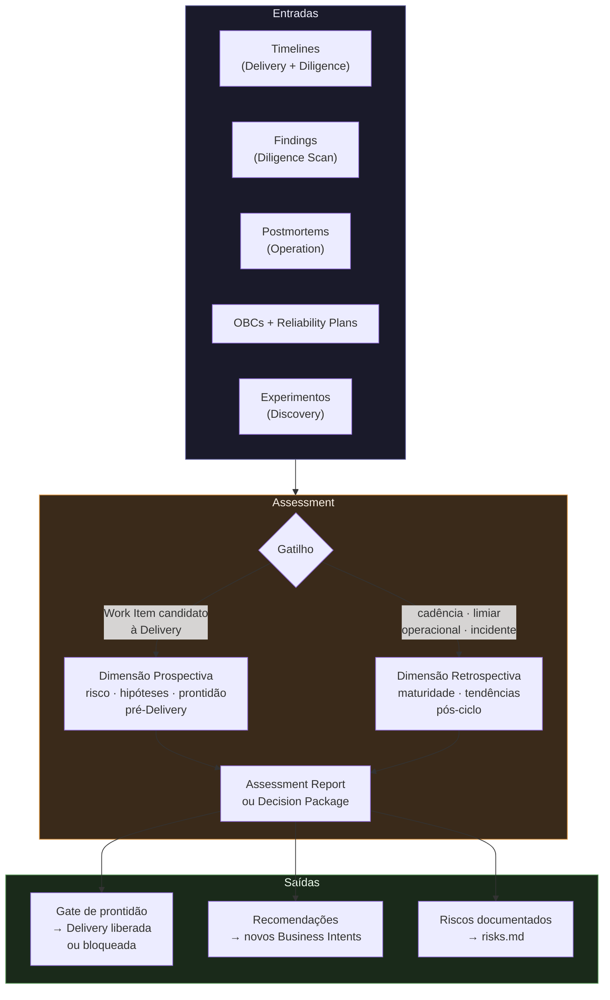

[English](README.en.md)

# Assessment — Fundação da Jornada
# ProdOps Framework

> **Versão:** 1.0.0
> **Status:** Canônico
> **Depende de:** [OEM Timeline](../../events/timeline.md) · [Delivery](../delivery/README.md) · [Diligence](../diligence/README.md)

---



## Questão central

> **"Estamos melhorando continuamente o nosso modelo operacional?"**

Assessment é a Jornada que avalia o modelo operacional ao longo do tempo. Ela não executa
Delivery. Ela não executa Diligence. Ela consome as evidências produzidas por ambas para
avaliar maturidade, identificar tendências e produzir recomendações de evolução.

A Assessment também atua como gate de qualidade antes da execução — avaliando riscos,
hipóteses e prontidão de Work Items antes que entrem na Delivery. Essas duas dimensões
(prospectiva e retrospectiva) compõem a missão completa da Jornada.

---

## 1. Missão

### 1.1 Propósito

Assessment existe para fechar o ciclo de melhoria contínua do Framework. Enquanto a Delivery
executa e a Diligence verifica, a Assessment avalia se o resultado acumulado representa
evolução real do modelo operacional — e se os próximos Work Items têm condições de ser
executados com qualidade.

Sem Assessment, o Framework produz sem refletir. Com Assessment, cada ciclo de execução
alimenta o aprendizado do próximo.

**Dimensão prospectiva:** avalia hipóteses, riscos e prontidão antes da Delivery.
**Dimensão retrospectiva:** avalia o que as Timelines e Findings revelam sobre o modelo.

### 1.2 Início

Uma Assessment pode ser iniciada por quatro gatilhos:

| Gatilho | Exemplo |
|---|---|
| **Cadência periódica** | Revisão trimestral, revisão pós-release |
| **Limiar operacional** | Gate Failure Rate > 20% em 30 dias; Cycle Time aumentou 40% |
| **Sinal externo** | Incidente com impacto em produção; postmortem concluído |
| **Solicitação explícita** | Work Item candidato à Delivery sem Assessment realizado |

### 1.3 Término

Uma Assessment termina quando:

1. O resultado foi publicado formalmente (Assessment Report ou Decision Package)
2. As recomendações foram formalizadas e assignadas
3. O próximo gatilho de Assessment foi definido

Uma Assessment não termina com a análise concluída — termina com a publicação do resultado
e a definição do próximo ciclo. Sem publicação, a análise não produziu efeito.

### 1.4 Entradas

| Entrada | Origem | O que fornece |
|---|---|---|
| **Operational Timelines** | Delivery, Diligence | Sequência de eventos por Work Item — fonte primária de métricas |
| **Derived Metrics** | Timelines (calculadas) | Lead Time, Cycle Time, Block Time, DORA, Gate Failure Rate, Rework Rate |
| **Findings** | Diligence (Scan) | Achados estruturais — anomalias observadas |
| **Divergence reports** | Diligence (Scan) | Padrões de não-conformidade ao longo de ciclos de varredura |
| **OBCs** | Artefatos | Contexto de negócio dos Work Items analisados |
| **Reliability Plans** | Artefatos | Compromissos de risco e confiabilidade firmados |
| **Release Trails** | Artefatos | Frequência de deploy, rollback rate, histórico de releases |
| **Evidence References** | Event Instances (OEM) | Evidências vinculadas a eventos registrados nas Timelines |
| **Experimentos e hipóteses** | Discovery | Aprendizados de pesquisa que informam decisões de priorização |
| **Postmortems e incidentes** | Operation | Sinais de falha em produção que atualizam avaliação de risco |

### 1.5 Saídas

| Saída | Dimensão | Descrição |
|---|---|---|
| **Assessment Report** | Retrospectiva | Análise formalizada com métricas, padrões e conclusões do período |
| **Recommendations** | Retrospectiva | Ações específicas, atribuídas e priorizadas para melhoria do modelo |
| **Evolution Plan** | Retrospectiva | Roadmap de evolução de Journeys ou do Framework |
| **Decision Package** | Prospectiva | Conjunto de evidências e recomendações para uma decisão específica |
| **Reliability Plan** | Prospectiva | Plano de risco e confiabilidade para Work Items que exigem gate |
| **New Business Intents** | Ambas | OBCs propostos com base em oportunidades identificadas |
| **Process improvement proposals** | Ambas | Ajustes em Delivery ou Diligence sem alterar o modelo |
| **Framework update suggestions** | Ambas | Propostas formais de revisão do Framework |

---

## 2. Responsabilidades

### 2.1 O que pertence à Assessment

- Avaliar maturidade operacional com base em evidências das Timelines
- Calcular e interpretar métricas derivadas das Timelines
- Identificar padrões e tendências ao longo do tempo
- Sintetizar Findings da Diligence em conclusões de nível de modelo
- Avaliar riscos, oportunidades e hipóteses antes da Delivery
- Produzir Reliability Plans para Work Items que exigem gate formal
- Formular recomendações acionáveis para melhoria
- Propor evoluções de Journeys ou do Framework
- Monitorar continuamente indicadores de saúde operacional
- Publicar resultados formalmente (Assessment Report, Decision Package)

### 2.2 O que NÃO pertence à Assessment

| Ação proibida | Por quê |
|---|---|
| Executar Bootstrap, Hack, Sync, Finish, Ship, Validate, Promote | Execução pertence à Delivery |
| Executar Capture, Attach, Scan, Flag, Repair | Execução pertence à Diligence |
| Criar ou emitir Operational Events | A Assessment não escreve nas Timelines |
| Alterar Timelines existentes | Timelines são imutáveis — consumo é read-only |
| Gerenciar Work Items individualmente | Responsabilidade de Delivery e Diligence |
| Aprovar ou rejeitar promoções individuais | Decisões operacionais pertencem às Journeys de execução |
| Criar Event Types ou Shared Types | Governança do OEM — não responsabilidade da Assessment |
| Modificar catálogos de eventos | Responsabilidade do Framework via OEM governance |
| Priorizar o backlog diretamente | Priorização pertence à Discovery ou ao responsável de produto |

---

## 3. Relação com as outras Journeys

A Assessment é um consumidor read-only das saídas de outras Journeys. Não existe acoplamento
direto com Delivery ou Diligence — toda a informação chega via artefatos imutáveis (Timelines,
Findings, Reports, Evidências).

```
Discovery ──────────────────────────────────┐
  Experimentos e aprendizados                │
  Hipóteses a avaliar                        │
                                             │
Delivery ───────────────────────────────────┤
  Timelines (Lead Time, Cycle Time,          │
  Block Time, Gate Failure Rate,             │
  Rework Rate, DORA metrics)                 ├──► ASSESSMENT
  Release Trails                             │         │
  OBCs                                       │         │
                                             │         ▼
Diligence ──────────────────────────────────┤   Assessment Report
  Scan Findings                             │   Decision Package
  Divergence patterns                       │   Recommendations
  Conformance trends                         │   Evolution Plan
  Waiver history                             │   Reliability Plans
                                             │
Operation ──────────────────────────────────┘
  Incidentes e postmortems
  Sinais de produção
```

### 3.1 Delivery → Assessment (leitura)

| Artefato | O que a Assessment lê |
|---|---|
| Timelines | Sequência de eventos para cálculo de métricas e análise de tendências |
| Release Trails | Frequência e qualidade de releases |
| OBCs | Contexto de negócio — correlaciona métricas com objetivos |
| Gate history (via Timeline) | Taxa de falha de gates por categoria e período |

### 3.2 Diligence → Assessment (leitura)

| Artefato | O que a Assessment lê |
|---|---|
| Scan Findings | Anomalias estruturais identificadas por varredura |
| Divergence records | Padrões de não-conformidade — frequência, severidade, tipo |
| Waiver history | Exceções concedidas — indicador de débito de conformidade acumulado |
| Conformance rate | Proporção de Work Items em conformidade ao longo do tempo |

### 3.3 Assessment → Delivery (indireto)

A Assessment não modifica a Delivery diretamente. Suas saídas que influenciam a Delivery:
- **Decision Package** que define se um Work Item pode entrar no Iteration Plan
- **Reliability Plan** que é gate adicional para Work Items de alto risco
- **Recommendations** que podem propor: novos critérios de gate, ajustes de fase, novos OBCs

A implementação dessas mudanças ocorre via Framework governance — a Assessment propõe,
o Framework governa, a Delivery executa.

### 3.4 Assessment → Diligence (indireto)

A Assessment pode propor novos critérios de scan ou regras de conformidade via recommendations.
A Diligence os executa somente após aprovação via Framework governance.

### 3.5 O que nunca acontece

- Assessment não chama Delivery para reexecutar um Work Item
- Assessment não triggera ciclos de Scan na Diligence
- Assessment não aprova artefatos individuais de Work Items
- Assessment não emite eventos nas Timelines de outras Journeys
- Assessment não prioriza o backlog — informa, não decide

---

## 4. Entradas — detalhamento

### 4.1 Operational Timelines (entrada primária)

A Timeline é a entrada mais valiosa da Assessment retrospectiva. Cada Timeline de Work Item
contém a sequência completa de eventos com timestamps — o único registro verídico de como
o trabalho realmente aconteceu.

Da Timeline, a Assessment deriva:

```
Lead Time(W)      = timestamp(Done) - timestamp(primeiro evento)
Cycle Time(W)     = timestamp(Done) - timestamp(início de desenvolvimento)
Block Time(W)     = Σ (Impediment.Resolved.ts - Impediment.Declared.ts)
Rework Cycles(W)  = count(Rework.Declared em Timeline(W))
Gate Failure Rate = count(Gate.Failed) / count(Gate.Passed + Gate.Failed)
```

### 4.2 Findings da Diligence

Findings não alteram o Derived State de Work Items — são observações de auditoria.
A Assessment os usa para identificar padrões: que tipos de Finding se repetem? Em que
contextos? Com que frequência? Isso indica onde o modelo operacional tem gaps estruturais.

### 4.3 OBCs como contexto

OBCs permitem correlacionar métricas com objetivos de negócio. Um alto Cycle Time pode
ser aceitável para OBCs de alta complexidade e inaceitável para OBCs críticos. Sem OBCs
como contexto, métricas são números — com eles, são indicadores.

### 4.4 Reliability Plans

Reliability Plans definem os compromissos de risco firmados antes de cada Delivery.
A Assessment retrospectiva avalia: os planos foram efetivos? Os riscos identificados
se materializaram? Houve riscos não previstos? Isso calibra futuros planos.

### 4.5 Postmortems e incidentes (via Operation)

Incidentes em produção e seus postmortems são sinais de falha do modelo operacional.
A Assessment os usa para identificar: o modelo de Delivery detectou o risco antes? A
Diligence sinalizou alguma divergência relacionada? A resposta informa a avaliação de
maturidade e as recomendações.

---

## 5. Saídas — detalhamento

### 5.1 Assessment Report

O Assessment Report é o produto formal de um ciclo retrospectivo. Inclui:

- Período analisado e escopo de Work Items
- Métricas calculadas com tendência (melhora / estável / degradação)
- Padrões identificados (positivos e negativos)
- Causas prováveis dos padrões identificados
- Correlação com Findings e Divergências da Diligence
- Conclusão sobre maturidade operacional no período

### 5.2 Decision Package

O Decision Package é o produto formal de um ciclo prospectivo. Inclui:

- Contexto do Work Item ou hipótese avaliada
- Riscos e oportunidades identificados
- Análise de viabilidade e adequação
- Recomendação objetiva: avançar / pausar / rejeitar

### 5.3 Recommendations

Cada Recommendation é específica, atribuída, priorizada e rastreável à evidência que
a fundamenta. Exemplos:

- "Reduzir Gate Failure Rate em CI-lint de 34% para <10% — responsável: Delivery Skills review"
- "Atualizar critérios de scan da Diligence para incluir verificação de Evidence References"
- "OBC X mostra Cycle Time 3x acima da média — investigar precondições de Bootstrap"

### 5.4 Evolution Plan

Resultado de Assessments que identificam necessidade de mudança estrutural. Propõe:
alterações em Skills ou Capabilities, novos ciclos ou fases, promoção de tipos para
Shared Types, revisão de conceitos da Ontologia ou Taxonomia.

---

## 6. Ciclos

A Assessment opera em dois ciclos independentes:

### 6.1 Assessment Sync — Revisão Estruturada

Ciclo formal, acionado por um gatilho definido.

```
Collect → Analyze → Synthesize → Report
```

| Step | O que acontece |
|---|---|
| **Collect** | Coleta e indexação de evidências das Timelines e artefatos do período |
| **Analyze** | Cálculo de métricas, identificação de padrões, correlação de Findings |
| **Synthesize** | Consolidação de insights em conclusões de alto nível |
| **Report** | Formalização e publicação do Assessment Report ou Decision Package |

**Trigger:** cadência periódica, sinal externo, ou solicitação explícita.
**Output:** Assessment Report + Recommendations; ou Decision Package + Reliability Plan.

### 6.2 Assessment Async — Monitoramento Contínuo

Ciclo contínuo, sem trigger discreto — observa o modelo operacional permanentemente.

```
Monitor → Alert → Evolve
```

| Step | O que acontece |
|---|---|
| **Monitor** | Observação contínua de métricas derivadas de Timelines e Findings |
| **Alert** | Detecção de limiares cruzados ou anomalias — gera sinal para Sync |
| **Evolve** | Propostas incrementais de melhoria que não exigem ciclo Sync completo |

**Trigger:** contínuo (sem início e fim discretos por ciclo).
**Output:** sinais de alerta para Assessment Sync; Evolution proposals incrementais.

### 6.3 Interação entre ciclos

```
Assessment Async (Monitor permanente)
    │
    │ limiar cruzado ou anomalia detectada
    ▼
Assessment Sync (Revisão estruturada acionada)
    │
    │ Report publicado
    ▼
Assessment Async (retoma monitoramento)
```

---

## 7. Capabilities

| Capability | Descrição |
|---|---|
| **Evidence Collection** | Coleta, indexação e qualificação de evidências das Timelines e artefatos de outras Journeys |
| **Metric Derivation** | Cálculo de métricas operacionais a partir de Timelines (Lead Time, Cycle Time, Block Time, DORA, Gate Failure Rate) |
| **Pattern Recognition** | Identificação de padrões temporais e estruturais nos dados coletados — tendências de melhoria ou degradação |
| **Maturity Evaluation** | Avaliação do nível de maturidade operacional com base nos padrões identificados |
| **Risk and Opportunity Analysis** | Análise prospectiva de riscos e oportunidades antes de Work Items entrarem na Delivery |
| **Recommendation Synthesis** | Formulação de Recommendations específicas, atribuídas e priorizadas com evidência citada |
| **Evolution Proposal** | Proposta formal de evolução de Journeys, Skills, Capabilities ou do Framework com justificativa baseada em evidências |
| **Continuous Monitoring** | Observação permanente de indicadores de saúde operacional — detecta limiares e anomalias |

---

## 8. Integração com o Operational Event Model

### 8.1 Assessment é consumidor read-only

A Assessment é um Consumer de Timelines — ela lê, nunca escreve. A imutabilidade das
Timelines garante que a fonte de verdade nunca seja contaminada pelo processo de análise.

```
Timeline(W) ──read-only──► Assessment Consumer
                              │
                              ├── calcula métricas
                              ├── identifica padrões
                              ├── aplica Lookback
                              └── não emite eventos
```

### 8.2 Uso de Derived State

A Assessment usa Derived State para entender o estado atual de conjuntos de Work Items:
- Quantos Work Items estão em BLOCKED agora?
- Quantos estão em VALIDATING há mais de N dias?
- Qual a distribuição de Derived States em um dado momento?

O Derived State não é armazenado — a Assessment o recalcula sob demanda sobre as Timelines.

### 8.3 Uso de Lookback

A Assessment usa Lookback (formalizado em `timeline.md`) para consultas retroativas:
- Qual era o Derived State de um Work Item em uma data específica?
- Quanto tempo um Work Item passou em cada estado?
- Quando um padrão de Gate Failure surgiu pela primeira vez?

O Lookback é read-only e idempotente — a Assessment pode repeti-lo indefinidamente.

### 8.4 Uso de Replay (conceitual)

Para reconstruir estados históricos de conjuntos de Work Items:
- Qual era a distribuição de Derived States em 2026-Q1?
- Como evoluiu o Lead Time médio entre 2025-Q4 e 2026-Q1?

O Replay é read-only e histórico — não altera nenhuma Timeline.

### 8.5 O que a Assessment NÃO faz com o OEM

- **Não cria Event Types** — nenhum novo tipo de evento para a Assessment ou qualquer Journey
- **Não emite Events** — não produz instâncias de eventos nas Timelines de Delivery ou Diligence
- **Não altera Timelines** — consumo estritamente read-only
- **Não cria Shared Types** — promoção de tipos é responsabilidade do Framework via `lifecycle.md`

### 8.6 Assessment e sua própria Timeline

A Assessment não possui Timeline no MVP atual — seus resultados são artefatos textuais
(Assessment Report, Recommendations, Evolution Plan). Em versões futuras, o Assessment
pode ter sua própria Timeline para registrar ciclos formalmente via OEM.

---

## 9. Critérios de sucesso

| # | Critério | Verificação |
|---|---|---|
| 1 | Escopo e período da análise foram definidos explicitamente | Report contém janela temporal e escopo de Work Items |
| 2 | Evidências foram coletadas de Timelines completas do período | Pelo menos uma Timeline por ciclo de Delivery e/ou Diligence no escopo |
| 3 | Métricas-núcleo foram calculadas (ciclo retrospectivo) | Lead Time, Cycle Time, Block Time, Gate Failure Rate presentes |
| 4 | Tendência foi classificada | Cada métrica: melhorando / estável / degradando |
| 5 | Ao menos um padrão foi identificado e explicado | Pattern recognition produziu pelo menos uma conclusão fundamentada |
| 6 | Ao menos uma Recommendation ou Decision foi produzida | Específica, atribuída, priorizada, com evidência citada |
| 7 | O resultado foi publicado formalmente | Artefato disponível em `prodops/artifacts/` |
| 8 | O próximo trigger de Assessment foi definido | Data ou limiar registrado explicitamente |

---

## 10. Fronteiras com as outras Journeys

```
┌──────────────────┬──────────────────┬──────────────────┬──────────────────┐
│ Dimensão         │ Delivery         │ Diligence        │ Assessment       │
├──────────────────┼──────────────────┼──────────────────┼──────────────────┤
│ Questão          │ Como entrego?    │ Estou conforme?  │ Estou melhorando?│
│ Nível            │ Individual       │ Individual       │ Agregado         │
│ Temporalidade    │ Transacional     │ Verificação      │ Retrospectivo /  │
│                  │ (por Work Item)  │ periódica        │ contínuo         │
│ Escrita OEM      │ Sim (emite       │ Sim (emite       │ Não (read-only)  │
│                  │ eventos)         │ eventos)         │                  │
│ Output primário  │ Software em      │ Conformance      │ Insights e       │
│                  │ produção         │ (sim/não)        │ recomendações    │
│ Objeto de        │ Work Item (OBC)  │ Work Item (OBC)  │ Modelo           │
│ trabalho         │                  │                  │ operacional      │
│ Trigger          │ Work Item no     │ Scan periódico   │ Cadência /       │
│                  │ Iteration Plan   │ ou divergência   │ limiar / sinal   │
│ Acoplamento OEM  │ Produtor         │ Produtor         │ Consumidor       │
└──────────────────┴──────────────────┴──────────────────┴──────────────────┘
```

---

## Artefatos

| Artefato | Localização |
|---|---|
| Riscos | [../../../artifacts/risks/risks.md](../../../artifacts/risks/risks.md) |
| Oportunidades | [../../../artifacts/risks/opportunities.md](../../../artifacts/risks/opportunities.md) |
| Reliability Plans | [../../../artifacts/plans/reliability/](../../../artifacts/plans/reliability/) |
| Event Storming | [../../../artifacts/event-storming/](../../../artifacts/event-storming/) |
| Arquitetura | [../../../artifacts/architecture/](../../../artifacts/architecture/) |
| OBCs (referência) | [../../../artifacts/obcs/](../../../artifacts/obcs/) |
| Iteration Plans (referência) | [../../../artifacts/plans/](../../../artifacts/plans/) |

---

## Referências

- [OEM Fundação](../../events/README.md)
- [Timeline OEM](../../events/timeline.md)
- [Event Type Schema](../../events/event-type-schema.md)
- [Delivery Journey](../delivery/README.md)
- [Diligence Journey](../diligence/README.md)
- Cross-Journey Event Analysis
