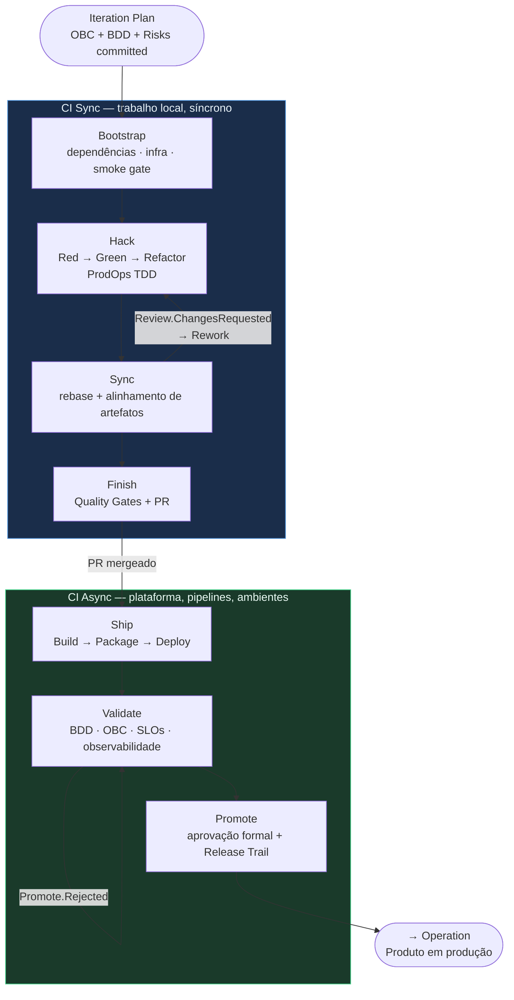

# Jornada Delivery



Delivery é a jornada de implementação do Framework ProdOps.

## Responsabilidade

Construir, validar e promover a solução. A Delivery representa a execução da iteração — não faz priorização, não faz Discovery, não substitui nenhum backlog.

## Entrada

A Delivery começa somente quando um item entra no **Iteration Plan**.

A entrada da Delivery **não é**:
- Intent
- Icebox
- Iteration Backlog

Um item só entra no Iteration Plan quando possui OBC committed + BDD Feature committed + riscos documentados. O Reliability Plan é gate adicional **quando houver** movimentação financeira, integração externa, mudança de SLO, risco alto/crítico, alteração de persistência ou segurança. Fora desses gatilhos, o Reliability Plan é opcional.

## Fluxo

```
Iteration Plan
  ↓
CI Sync: Bootstrap → Hack → Sync → Finish     (trabalho local, síncrono)
  ↓
CI Async: Ship → Validate → Promote            (plataforma, pipelines, ambientes)
  ↓
Operation
```

## CI Sync

→ [ci-sync.md](ci-sync.md)

## CI Async

→ [ci-async.md](ci-async.md)

## Fases

| Fase | Descrição | Link |
|---|---|---|
| Bootstrap | Dependências + infraestrutura local + configuração + smoke gate | [phases/bootstrap/README.md](phases/bootstrap/README.md) |
| Hack | Implementação via ProdOps TDD | [phases/hack/README.md](phases/hack/README.md) |
| Sync | Consistência de artefatos | [phases/sync/README.md](phases/sync/README.md) |
| Finish | Quality Gates + PR | [phases/finish/README.md](phases/finish/README.md) |
| Ship | Preparation + Deployment | [phases/ship/README.md](phases/ship/README.md) |
| Validate | Runtime + observabilidade + SLO | [phases/validate/README.md](phases/validate/README.md) |
| Promote | Aprovação formal + Release Trail | [phases/promote/README.md](phases/promote/README.md) |

## Practices

→ [practices/prodops-tdd.md](practices/prodops-tdd.md)
→ [practices/testing-policy.md](practices/testing-policy.md)
→ [practices/integration-testing-policy.md](practices/integration-testing-policy.md)

## Capabilities compartilhadas

→ [capabilities/](capabilities/)
