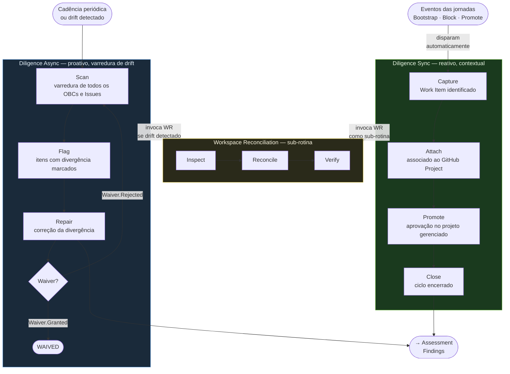

[English](README.en.md)

# Diligence — Jornada Transversal

## Definição

> **Diligence é a jornada transversal responsável por garantir continuamente a consistência do sistema de trabalho do ProdOps, verificando coerência, completude, rastreabilidade e conformidade entre conhecimento, decisões, execução e evidências.**

---



## Propósito

A Diligence garante que o que foi decidido, produzido e executado em cada jornada permaneça coerente, rastreável e conforme ao longo de todo o ciclo de vida do produto. Ela não avalia, não decide, não implementa — ela verifica, sincroniza, reconcilia e preserva.

---

## Questão principal

> **O conhecimento, as decisões, a execução e as evidências continuam coerentes e rastreáveis?**

---

## Natureza transversal

A Diligence não é uma etapa linear ao final de um fluxo. Ela é transversal: verifica consistência, rastreabilidade, completude e conformidade em todas as jornadas simultaneamente.

```
                    DISCOVERY
                        │
                        ▼
                    ASSESSMENT
                        │
                        ▼
                     DELIVERY
                        │
                        ▼
                    OPERATION
                        │
                        └──────────┐
                                   │
DILIGENCE ─────────────────────────┤
                                   │
verifica consistência,             │
rastreabilidade, completude        │
e conformidade em todas            │
as jornadas                        │
                                   ▼
                              novos sinais,
                              decisões e trabalho
```

A Diligence acompanha o produto enquanto ele existir. Não tem início e fim por ciclo. Não é uma reunião semanal nem um ritual de sprint. É verificação contínua que ocorre toda vez que o estado do sistema muda — ou quando a varredura periódica detecta drift.

---

## As cinco jornadas

| Jornada | Questão central |
|---|---|
| Discovery | O que precisamos compreender antes de assumir um compromisso? |
| Assessment | Qual é a situação e o que deve ser decidido ou preparado? |
| Delivery | Como transformar o compromisso em mudança verificável? |
| Operation | O produto está produzindo os resultados e comportamentos esperados? |
| **Diligence** | **O conhecimento, as decisões, a execução e as evidências continuam coerentes e rastreáveis?** |

---

## Escopo

A Diligence governa a consistência do **sistema de trabalho ProdOps**: artefatos, backlogs, ferramentas de gestão, representações operacionais, trilhas de decisão e evidências. Não governa o código do produto nem o comportamento em produção — esses pertencem à Delivery e à Operation.

**O sistema de trabalho inclui:**
- Artefatos do Knowledge Space: Business Signals, Business Intents, OBCs, BDD Features, Reliability Plans, Iteration Plans, Roadmap, Tracking Lists
- Representações operacionais no Execution Space: Work Items, Views, GitHub Projects, Labels, Custom Fields
- Trilhas de decisão: trails, registros de sessão, histórico de artefatos
- Relações de rastreabilidade entre artefatos e operações

---

## Limites

### O que a Diligence PODE fazer

- Detectar divergências entre Knowledge Space e Execution Space
- Verificar relações entre artefatos e Work Items
- Validar pré-condições de transição antes que um fluxo avance
- Reconciliar Knowledge Space e Execution Space
- Registrar decisões já legitimadas por jornadas competentes
- Materializar Work Items quando há operação ativa e autorizada
- Verificar se uma promoção satisfaz critérios existentes
- Atualizar representações operacionais derivadas
- Produzir relatórios de consistência
- Solicitar ou registrar correções
- Verificar se correções foram aplicadas completamente
- Preservar rastreabilidade histórica
- Identificar drift estrutural ou documental

### O que a Diligence NÃO pode fazer

- Decidir estratégia de produto
- Priorizar o Product Backlog no lugar do Product Owner
- Inventar conteúdo de Business Signals, Business Intents ou OBCs
- Aprovar um OBC sozinha
- Substituir o Discovery
- Executar o Assessment
- Implementar código do produto
- Declarar um resultado operacional sem evidências
- Transformar o GitHub Project na fonte de verdade do Knowledge Space
- Criar uma Issue para cada artefato por padrão
- Corrigir silenciosamente conteúdo canônico sem autorização
- Reescrever trilhas históricas para adequá-las ao vocabulário atual

---

## Cinco dimensões de consistência

| # | Dimensão | O que verifica |
|---|---|---|
| 1 | **Conceitual** | Documentos usam ontologia, vocabulário, estados, relações e responsabilidades compatíveis |
| 2 | **Estrutural** | Estrutura real de arquivos, diretórios, índices, links e schemas corresponde ao modelo documentado |
| 3 | **Rastreabilidade** | É possível reconstruir as relações Signal → Intent → OBC → BDD → planos → riscos → decisões → Work Items → PRs → Releases → evidências |
| 4 | **Operacional** | Operações no GitHub respeitam schema, estado, propriedade, dependências, critérios de entrada/saída, fechamento e evidência |
| 5 | **Temporal** | O sistema preserva história, trilhas, decisões passadas e o estado observado em cada momento. Uma trilha histórica com vocabulário antigo **não é automaticamente** uma inconsistência — só quando usada como instrução normativa atual |

---

## Entradas (o que aciona a Diligence)

A Diligence pode ser acionada por qualquer um dos seguintes eventos. **Nem todo evento resulta em criação de Issue ou Work Item** — o evento inicia uma avaliação de se há operação rastreável necessária.

- Novo Business Signal ou Business Intent
- Criação ou atualização de OBC
- Decisão de Assessment
- Mudança de estado de artefato
- Entrada em Backlog ou View
- Operação ativa sem Work Item
- Work Item sem referência válida
- Pull Request
- Release
- Mudança em documentação normativa
- Evidência operacional
- Incidente, risco ou divergência detectada
- Execução periódica
- Solicitação humana
- Execução de Bootstrap
- Mudança estrutural no workspace

---

## Classes de saída

As classes de resultado que a Diligence pode produzir (sem implementação de schemas formais nesta versão):

- Sincronização concluída
- Representação operacional criada ou atualizada
- Divergência detectada
- Inconsistência reconciliada
- Pré-condição validada
- Promoção autorizada por regras existentes
- Promoção bloqueada
- Evidência registrada
- Relatório de consistência
- Recomendação de correção
- Necessidade de Assessment identificada
- Necessidade de decisão humana identificada
- Necessidade de nova operação identificada
- Impossibilidade de reconciliação automática

> **Nota:** As classes formais Check, Finding, Evidence, Remediation e Waiver são conceitos planejados para versões futuras. Ver seção "Conceitos futuros planejados".

---

## Ciclos

A Diligence opera em exatamente **dois ciclos** complementares. Workspace Reconciliation é uma Capability invocada pelos ciclos — não é um terceiro ciclo.

### diligence-sync — Síncrono e reativo

Acionado por um evento ou operação em andamento. Contextual: ligado a uma operação ou transição específica. Pode bloquear a transição de um fluxo quando critérios canônicos não são satisfeitos. Não é periódico.

```
diligence-sync: Capture → Attach → Promote → Close
```

→ [diligence-sync.md](diligence-sync.md)

### diligence-async — Assíncrono e proativo

Iniciado por varredura periódica ou suspeita de drift. Não depende de uma transação específica em andamento. Detecta drift acumulado e reconcilia o sistema sem aguardar evento externo.

```
diligence-async: Scan → Flag → Repair
```

→ [diligence-async.md](diligence-async.md)

---

## Fases por ciclo

| Ciclo | Fase | O que faz | O que NÃO faz |
|---|---|---|---|
| diligence-sync | **Capture** | Cria ou atualiza o OBC com estado canônico da decisão que acionou o ciclo | Não cria Work Items; não inventa conteúdo |
| | **Attach** | Verifica se existe Work Item ativo; cria se há operação ativa sem rastreamento | Não cria Issue para artefato passivo |
| | **Promote** | Move o item pela hierarquia verificando pré-condições de cada transição; bloqueia quando critério não satisfeito | Não promove sem critérios; não decide o backlog |
| | **Close** | Fecha o Work Item quando OBC atinge Operational e Release Trail registra a entrega | Não fecha prematuramente; não apaga histórico |
| diligence-async | **Scan** | Lê todos os OBCs ativos; compara com backlogs externos; identifica gaps; distingue ausência legítima de relação incompleta | Não repara durante Scan; não cria artefatos |
| | **Flag** | Classifica divergências com severidade e ação sugerida; marca como BLOQUEADO quando requer decisão de produto | Não executa reparos; não decide por conta própria |
| | **Repair** | Executa correções identificadas; invoca steps de diligence-sync para gaps reparáveis | Não modifica código; não altera artefatos canônicos silenciosamente; não corrige trilhas históricas |

---

## Capabilities

Capabilities são competências reutilizáveis consumidas pelos ciclos e pelo Bootstrap. **Não são ciclos independentes.**

| Capability | Propósito | Invocada por |
|---|---|---|
| Backlog Synchronization | Manter o estado do OBC consistente entre todos os níveis da hierarquia de backlogs | Capture, Promote, Repair |
| Work Item Management | Criar, atualizar e fechar Work Items referenciando OBCs, operações e jornadas corretamente | Attach, Close, Repair |
| Readiness Verification | Verificar pré-requisitos antes que um item avance ou entre em Delivery | Promote, Scan |
| Divergence Detection | Identificar proativamente gaps entre artefatos canônicos e ferramentas externas | Scan, Flag |
| Artifact Evolution | Atualizar artefatos de gestão quando decisões mudam o estado do trabalho | Capture, Repair, Close |
| Workspace Reconciliation | Alinhar GitHub Workspace à Canonical Specification via Inspect → Reconcile → Verify | Bootstrap, Diligence Async, Diligence Sync |

→ [Catálogo completo de Capabilities](capabilities/README.md)
→ [Workspace Reconciliation — especificação](workspace-reconciliation.md)

---

## Participantes e responsabilidades

| Papel | Decide | Executa | Verifica | Escalar quando |
|---|---|---|---|---|
| Product Owner | Prioridades do backlog, aprovações de OBC | — | Alinhamento de negócio | Divergência requer repriorização do backlog |
| Portfolio PM | Decisões em nível de portfólio | — | Consistência entre produtos | Conflito de portfólio |
| Product Context Engineer | — | Operações de Diligence | Consistência de artefatos | Conteúdo de OBC requer clarificação de negócio |
| Product Reliability Engineer | — | Verificações de confiabilidade | Critérios de confiabilidade | Reliability Plan ausente para item qualificado |
| Tech Lead | Decisões técnicas | Reparos técnicos | Consistência técnica | Risco técnico irresolvível pela Diligence |
| AI Agent (autorizado) | — | Steps automatizados de Diligence | — | Confiança abaixo do limiar ou fonte de verdade ambígua |

---

## Acionadores (Triggers)

| Acionador | Ciclo tipicamente ativado |
|---|---|
| Evento externo (decisão, conclusão de experimento, sinal de Operation) | diligence-sync |
| Execução de Bootstrap | Workspace Reconciliation (Capability) |
| Varredura periódica agendada | diligence-async |
| Suspeita de drift detectada por outro agente | diligence-async |
| Transição de estado de OBC | diligence-sync (Promote) |
| PR ou Release registrado | diligence-sync (Attach ou Close) |
| Mudança em documentação normativa | diligence-async (Scan) |
| Solicitação humana explícita | Qualquer ciclo ou Capability conforme contexto |

---

## Relação com as outras quatro jornadas

### Discovery

A Diligence verifica se experimentos e aprendizados do Discovery foram registrados como artefatos; se Business Signals e Intents foram adequadamente documentados; se a transição de modo Upstream → Downstream foi formalmente registrada.

**A Diligence não executa Discovery.**

### Assessment

O Assessment avalia, diagnostica, identifica risco/oportunidade, recomenda, prepara planos, produz ou sustenta uma decisão.

A Diligence verifica se a decisão foi registrada; sincroniza sua representação operacional; valida que critérios derivados continuam sendo satisfeitos; detecta divergências; preserva rastreabilidade. **A Diligence não refaz o Assessment.**

**Exemplo canônico:** O Assessment conclui "Este item requer um Reliability Plan."
A Diligence verifica: (1) a decisão foi registrada; (2) o Reliability Plan existe; (3) o item não avançou sem o plano; (4) o Execution Space reflete a decisão. A Diligence não avalia se a decisão foi correta — apenas que ela foi seguida.

### Delivery

A Diligence garante que Work Items, BDD Features, Reliability Plans e demais pré-condições estejam satisfeitos antes que um item entre em Delivery. Verifica se Pull Requests referenciam Work Items canônicos. Verifica se o Release Trail registra a entrega corretamente.

**A Diligence não implementa código, não cria PRs de implementação e não executa phases da Delivery.**

### Operation

A Diligence recebe sinais de incidentes, riscos e evidências operacionais; verifica se foram registrados nos artefatos correspondentes; verifica se o estado dos OBCs reflete o estado operacional real.

**A Diligence não monitora produção nem declara resultado operacional sem evidências.**

---

## Knowledge Space ↔ Execution Space

```
Knowledge Space (prodops/)
    ↓ fornece intenção, contrato, decisão e contexto
Diligence — guardiã da sincronização entre os dois modelos
    ↓ verifica, relaciona, sincroniza e reconcilia
Execution Space (GitHub Projects / Issues)
    ↓ executa operações e produz evidências
Diligence
    ↓ verifica resultados e devolve aprendizado rastreável
Knowledge Space (prodops/)
```

> **Diligence é a guardiã da sincronização entre a representação conceitual (prodops/) e a representação operacional canônica (GitHub Projects e Issues).**

### Princípios fundamentais

- **GitHub Projects e Issues são a representação operacional canônica do ProdOps.** Não existe abstração para outras ferramentas.
- **Sincronização não é necessariamente bidirecional campo a campo.** Cada dado tem uma única fonte de verdade — a sincronização move dados da fonte para a representação derivada.
- **Cada ponto de dado tem fonte de verdade única.** O estado canônico de um OBC vive no arquivo Markdown. O estado operacional de um Work Item vive no GitHub Issue.
- **GitHub Project PODE:** exibir, agrupar, filtrar, derivar e organizar trabalho.
- **GitHub Project NÃO substitui** o conteúdo canônico de artefatos Markdown.

### Cardinalidade N:M

A relação entre Artefatos (Knowledge Space) e Work Items (Execution Space) é **N:M**:
- Um artefato pode ter zero, um ou múltiplos Work Items ao longo de sua vida (um por operação ativa)
- Um Work Item pode referenciar múltiplos artefatos quando a operação os afeta em conjunto
- **A ausência de Work Item não é uma divergência** quando não há operação ativa sobre o artefato

---

## Fontes de verdade

| Dado | Fonte de verdade canônica |
|---|---|
| Estado do OBC | Arquivo Markdown em `prodops/artifacts/obcs/` |
| BDD Feature | Arquivo `.feature` em `prodops/artifacts/bdd/` |
| Reliability Plan | Arquivo Markdown em `prodops/artifacts/reliability-plans/` |
| Iteration Plan | Arquivo Markdown em `prodops/exec/iteration-plans/` |
| Work Item schema | `prodops/framework/execution-mapping/work-item-schema.md` |
| GitHub Workspace spec | `prodops/framework/github-workspace.md` |
| Tracking Lists | Arquivos Markdown correspondentes |
| Ontologia ProdOps | `prodops/framework/ontology.md` |
| Glossário | `prodops/framework/glossary.md` |

---

## Protocolo de escalação

A Diligence deve escalar para decisão humana quando:

- Não há fonte de verdade definida para um dado
- Duas fontes normativas conflitam
- A correção altera a intenção de negócio do artefato
- A correção altera um estado sem critério satisfeito
- A reconciliação requer priorização de backlog
- Há risco de perda de dados históricos
- A automação pode modificar múltiplos artefatos sem confirmação
- A decisão pertence ao Product Owner, Portfolio, Assessment ou Tech Lead
- Evidências insuficientes para concluir
- A correção proposta viola uma decisão previamente registrada

**Alvos de escalação:** Product Owner, Portfolio PM, Assessment, Tech Lead, Reliability Owner, Framework Owner, Artifact Owner

---

## Anti-padrões

| Anti-padrão | Por que é errado |
|---|---|
| Criar uma Issue para cada artefato | Viola o modelo N:M; polui o Execution Space com trabalho fantasma |
| Tratar ausência de Issue como divergência automática | Artefato passivo (sem operação ativa) não requer Work Item |
| Usar Issue como fonte de verdade do OBC | O OBC canônico vive no arquivo Markdown — não no Issue |
| Reutilizar indefinidamente o mesmo Work Item para toda a vida do artefato | Cada operação ativa deve ter seu próprio Work Item rastreável |
| Confundir estado do artefato com estado do Work Item | São independentes: o artefato pode estar Committed enquanto o Work Item está Open |
| Promover item sem critérios satisfeitos | Viola os pré-requisitos de transição e quebra rastreabilidade |
| Inventar conteúdo de artefato durante sincronização | Conteúdo de artefato é decisão de negócio — Diligence sincroniza, não inventa |
| Executar Assessment dentro da Diligence | Diligence detecta divergências; não avalia nem recomenda estratégia |
| Modificar trilhas históricas para parecerem atuais | Trilhas históricas preservam o estado real do momento — não são corrigidas retroativamente |
| Corrigir automaticamente conteúdo canônico sem autorização | Toda correção de conteúdo canônico requer autorização da jornada competente |
| Classificar Workspace Reconciliation como Cycle | É uma Capability invocada pelos ciclos — não é um ciclo independente |
| Criar Views antes de definir schema e regras | Views são representações derivadas — o schema e as regras vêm primeiro |
| Tratar Diligence como etapa final linear | Diligence é transversal e contínua — não é uma fase que ocorre depois das outras |

---

## Exemplos

### Exemplo 1 — Business Signal passivo

Um Business Signal foi registrado. Nenhuma investigação está ativa.

**Estado esperado:** O artefato existe no Knowledge Space (arquivo na tracking list); nenhum Work Item é necessário. O Scan **não** sinaliza a ausência de Issue como divergência.

**Lição:** Artefato sem operação ativa = sem Work Item = sem divergência.

---

### Exemplo 2 — Business Signal com operação ativa

Uma investigação foi autorizada sobre o Business Signal.

**Estado esperado:** Operação ativa identificada; Work Item criado ou relacionado com campos estruturados preenchidos (artifact_id, operation, journey); referência ao Business Signal no Work Item. A ausência de Work Item nesta situação **é** uma divergência.

**Lição:** Operação ativa sem Work Item = divergência a reparar.

---

### Exemplo 3 — OBC promovido para Delivery

Assessment ou parte autorizada declarou readiness do OBC.

**Estado esperado:** A Diligence verifica critérios (OBC committed, BDD Feature committed, riscos documentados); Promote registra a transição; Work Item de implementação pode ser criado; OBC e Work Item mantêm estados independentes (OBC pode ser Committed enquanto Work Item está Open e em progresso).

**Lição:** Estados de artefato e Work Item são independentes — a Diligence os verifica sem confundi-los.

---

### Exemplo 4 — Drift no GitHub Project

Um campo obrigatório foi removido ou renomeado no projeto GitHub.

**Estado esperado:** Diligence Async executa Scan; divergência sinalizada; Workspace Reconciliation (Capability) invocada; Inspect identifica o estado atual sem modificar nada; Reconcile aplica a correção autorizada respeitando a hierarquia de fontes de verdade; Verify confirma o resultado.

**Lição:** Workspace drift → Workspace Reconciliation (Capability, não Cycle) → Inspect → Reconcile → Verify.

---

## Modelo de entidades operacionais

As entidades operacionais da Diligence — Finding, Check, Evidence, Remediation e Waiver — estão formalizadas em:

→ [`model/`](model/) — visão geral do modelo e relações
→ [`model/finding.md`](model/finding.md) — definição canônica do Finding
→ [`model/check.md`](model/check.md) — definição canônica do Check
→ [`model/evidence.md`](model/evidence.md) — definição canônica do Evidence
→ [`model/remediation.md`](model/remediation.md) — definição canônica do Remediation
→ [`model/waiver.md`](model/waiver.md) — definição canônica do Waiver

---

## Referências

→ [Ontologia ProdOps](../../ontology.md)
→ [Glossário](../../glossary.md)
→ [Execution Mapping](../../execution-mapping/README.md)
→ [Schema de Work Item](../../execution-mapping/work-item-schema.md)
→ [Knowledge Space vs. Execution Space](../../knowledge-vs-execution.md)
→ [Backlogs](../../backlogs.md)
→ [diligence-sync.md](diligence-sync.md)
→ [diligence-async.md](diligence-async.md)
→ [Capabilities](capabilities/README.md)
→ [Workspace Reconciliation](workspace-reconciliation.md)
