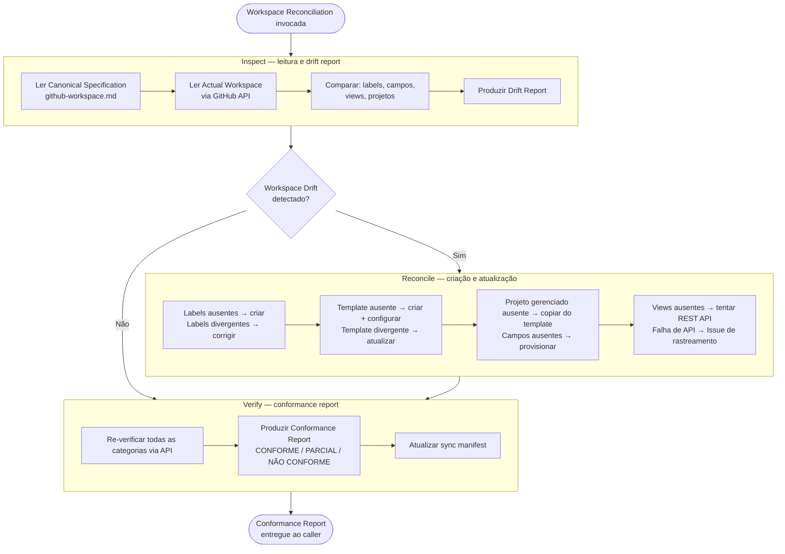

# Workspace Reconciliation

Workspace Reconciliation é uma **Capability** do ProdOps Diligence — não é um Cycle, não é uma Phase de nenhum Cycle, e não possui acionamento próprio independente.

É invocada como sub-rotina pelos ciclos diligence-sync e diligence-async, e pelo Bootstrap. Qualquer ponto do Framework que necessite alinhar a infraestrutura do GitHub Workspace pode invocar esta Capability — ela retorna um Conformance Report ao chamador e não persiste estado de execução.

Ela mantém o GitHub Workspace (Labels, Custom Fields, Views, projetos gerenciados) alinhado à **Canonical Specification** definida em `prodops/framework/github-workspace.md`.

> **Princípio:** A Canonical Specification é a fonte de verdade. O Actual Workspace é o estado real do GitHub. Qualquer divergência entre os dois é chamada de **Workspace Drift** e deve ser detectada, corrigida e verificada antes de qualquer jornada que dependa da infraestrutura.

---

## Conceitos centrais

| Conceito | Definição |
|---|---|
| **Canonical Specification** | O arquivo `prodops/framework/github-workspace.md` — define o que o GitHub Workspace deve conter: labels, campos, views e projetos gerenciados. É a fonte de verdade normativa. |
| **Actual Workspace** | O estado real dos recursos do GitHub (org, repositório, projetos) lido via API no momento da execução. |
| **Workspace Drift** | Qualquer divergência entre Canonical Specification e Actual Workspace — labels ausentes, campos faltando, views não criadas, projetos fora da spec. |

---

## Steps internos: Inspect → Reconcile → Verify

Os passos Inspect, Reconcile e Verify são **steps internos desta Capability** — não são Phases de nenhum Cycle da Diligence. Eles são executados exclusivamente dentro do escopo de uma invocação de Workspace Reconciliation.

**Hierarquia de fontes de verdade (respeitada pelo Reconcile):**
1. Canonical Specification (`prodops/framework/github-workspace.md`) — fonte normativa
2. Actual Workspace (estado real do GitHub lido via API) — estado a ser corrigido

O Reconcile nunca inverte essa hierarquia: quando há conflito, a Canonical Specification prevalece.

## Fluxo: Inspect → Reconcile → Verify



---

## Integração com Bootstrap

Workspace Reconciliation é invocada no Bootstrap de novos repositórios para garantir que a infraestrutura do GitHub esteja pronta antes de qualquer trabalho de Delivery.

```
Repository Bootstrap
       │
       ▼
Workspace Reconciliation
       │
       ▼
GitHub Workspace
```

O Bootstrap chama Workspace Reconciliation como pré-condição. Se o Conformance Report retornar `NÃO CONFORME`, o Bootstrap para e registra o bloqueio antes de prosseguir.

---

## Integração com Diligence Async

O ciclo Diligence Async invoca Workspace Reconciliation quando o Scan detecta sinais de Workspace Drift (Issues sem labels canônicas, projetos sem campos esperados).

```
Diligence Async
       │
       ▼
    Inspect
       │
       ▼
 Workspace Drift?
   ┌───┴────┐
   │        │
  No       Yes
   │        │
   │        ▼
   │    Reconcile
   │        │
   └────────▼
        Verify
```

O ciclo Async não chama Workspace Reconciliation em toda varredura — apenas quando Scan detecta drift explícito na infraestrutura.

---

## Integração com Diligence Sync

O ciclo Diligence Sync pode invocar Workspace Reconciliation quando o step Attach ou Promote falha por ausência de label canônica ou campo obrigatório no Project. Nesse caso, Workspace Reconciliation é executada como sub-rotina de correção antes de retomar o fluxo principal.

---

## Escopo: o que Workspace Reconciliation gerencia

### O que ela GERENCIA

| Recurso | Exemplos |
|---|---|
| GitHub Labels | `operation:capture`, `journey:delivery`, `artifact-type:local-obc` |
| GitHub Project Fields | `Artifact Type`, `Operation`, `Journey`, `Evidence Required` |
| GitHub Project Views | `All Work Items`, `By Operation`, `Delivery`, `Diligence` |
| GitHub Projects (gerenciados) | `ProdOps — template`, `ProdOps — <repo-name>` |

### O que ela NÃO gerencia

| Fora de escopo | Justificativa |
|---|---|
| Infraestrutura de nuvem (AWS, GCP, Azure) | Domínio de Ops/Infra — fora do ProdOps |
| Kubernetes / Helm / manifests | Fora do escopo do GitHub Workspace |
| Terraform / Pulumi / IaC | Provisionamento de infra — não é GitHub Workspace |
| CI/CD pipelines (GitHub Actions workflows) | Código de produto/automação — domínio de Delivery |
| Ambientes de runtime (staging, prod) | Operacional — domínio de Operation |
| GitHub Issues individuais | Sincronizados pelo Diligence Sync e Async |
| Milestones | Criados pelo Product Owner — Workspace Reconciliation apenas detecta ausência e registra Issue |

---

## Steps

| Step | Responsabilidade | Restrições | Arquivo |
|---|---|---|---|
| **Inspect** | Lê Canonical Specification e Actual Workspace; produz Drift Report completo. | **Não cria, não modifica, não remove nada** — leitura pura. | [steps/inspect/SKILL.md](../../../skills/diligence/workspace-reconciliation/steps/inspect/SKILL.md) |
| **Reconcile** | Executa criações e atualizações identificadas pelo Inspect. Para gaps não automatizáveis, abre Issue de rastreamento. | Nunca remove sem confirmação; respeita a hierarquia de fontes de verdade; nunca altera conteúdo de artefatos do Knowledge Space. | [steps/reconcile/SKILL.md](../../../skills/diligence/workspace-reconciliation/steps/reconcile/SKILL.md) |
| **Verify** | Confirma programaticamente o estado de todas as categorias após o Reconcile. Produz Conformance Report e atualiza o sync manifest. | Não aplica novas correções; apenas confirma o resultado do Reconcile. | [steps/verify/SKILL.md](../../../skills/diligence/workspace-reconciliation/steps/verify/SKILL.md) |

---

## Guardrails

- **Nunca operar em projetos manuais** — qualquer projeto cujo nome não comece com `ProdOps — ` é ignorado.
- **Identificar projetos por nome exato, nunca por número** — o número muda a cada recriação; o nome é o contrato.
- **Nenhum gap sem Issue de rastreamento** — divergências não automatizáveis geram Issue com responsável e critério de resolução.
- **Nunca declarar "ação manual" como texto flutuante** — a instrução para o humano vai no corpo do Issue; o output lista Automation Opportunities e Known Platform Limitations.
- **Automation First (Princípio 8)** — tentar API → MCP → CLI → SDK → Browser Automation antes de declarar qualquer limitação. Manual Exception somente quando tudo falhar, sempre com Issue de rastreamento aberto. Ver [automation-first.md](../../automation-first.md).
- **Sync manifest como registro de verdade** — atualizado pelo Verify ao final de cada execução.

---

## Referências

→ [Canonical Specification — github-workspace.md](../../github-workspace.md)
→ GitHub Sync Manifest: `prodops/artifacts/trails/github-sync-manifest.md` (criado pelo produto)
→ [Diligence journey README](../../README.md)
→ [Capabilities README](capabilities/README.md)
→ [Orchestrator SKILL.md](../../../skills/diligence/workspace-reconciliation/SKILL.md)
