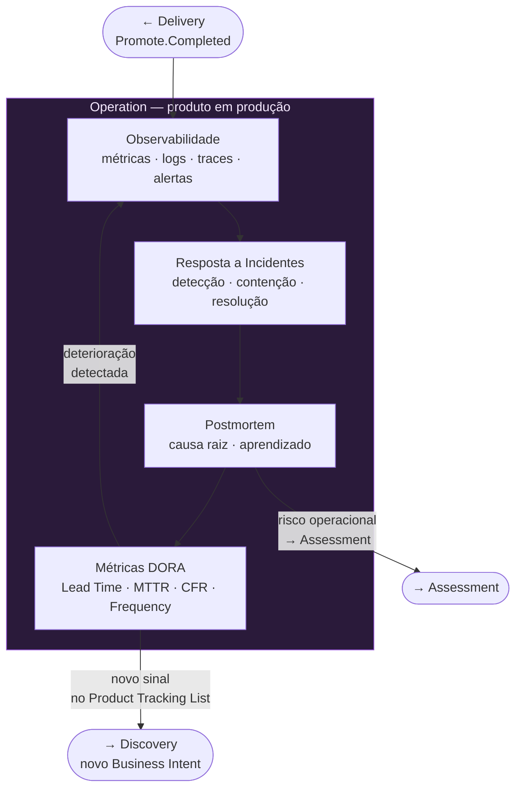

# Operation



## Responsabilidade

Operar e evoluir o produto em produção.

## Quando começa

A Operation inicia após a promoção da entrega pela fase Promote do CI Async.

## O que faz

- operação contínua do produto em produção
- observabilidade e monitoramento
- resposta a incidentes
- coleta de métricas operacionais
- postmortems e aprendizado operacional

Os aprendizados operacionais podem originar novos itens para o **Product Tracking List**. Esse é o mecanismo pelo qual a Operation alimenta o ciclo de evolução do produto.

## Arquivos

| Arquivo | Propósito |
|---|---|
| [incidents.md](incidents.md) | Registro e resposta a incidentes |
| [postmortems.md](postmortems.md) | Postmortems e análise de causa raiz |
| [runbooks.md](runbooks.md) | Runbooks operacionais |
| [operational-trail.md](operational-trail.md) | Trilha append-only de eventos operacionais |

## DORA como instrumento de saúde contínua

O Continuous Assessment usa as métricas DORA estendidas para identificar quando o produto precisa de uma nova Intent de melhoria. A Operation é a principal fonte de sinais que alimentam essas métricas.

**Métricas prioritárias no estágio atual do produto (MVP → IPR):**

| Métrica DORA | Peso neste estágio | Sinal operacional | Ação quando deteriora |
|---|---|---|---|
| Lead Time for Change | Alto (8→5) | Tempo médio entre commit e primeiro evento em produção | Intent Technology: revisar pipeline e automação |
| Reaction Time | Alto (5→3) | Gap `<signal>.received` → `<entity>.processed` | Intent Technology: revisar arquitetura de processamento |
| Release Frequency | Crescente (5→8) | Contagem de deploys por semana | Intent Team: revisar processo de entrega |
| Change Fail Rate | Crescente (3→5) | Taxa de `*_failed` correlacionada com deploys | Intent Technology: qualidade de testes e gates |
| MTTR | Crescente (1→3) | Gap evento de falha → recovery por `correlationId` | Intent Technology: runbooks + alertas |
| Availability | Crescente (2→3) | Razão sucesso/falha por OBC e janela de tempo | Intent Technology: SLO + error budget |
| Rate of Return | Crescente (3→5) | Taxa de `idempotency_hit` + `refund.requested` | Intent Team: processo de validação e qualidade |

**Como a Operation gera novas Intents via DORA:**

```
Operational Trail detecta deterioração de métrica DORA
  ↓
Continuous Assessment registra sinal em risks.md ou opportunities.md
  ↓
Novo item na Product Tracking List com Origin Stream identificado
  ↓
Premortem + Owner Approval → Product Backlog (Inception)
```

**Eventos de OBC que alimentam cada métrica DORA:**
→ Ver mapeamento completo em [`../dora-metrics.md`](../../dora-metrics.md)

**Assessment de maturidade:** executar periodicamente no Certificare com perfil `balanced` (ou conforme foco do momento) para obter score e roadmap de melhoria.

---

## Relação com outras jornadas

- **Delivery** alimenta a Operation com releases e evidências de deploy — Operation inicia após Promote.
- **Assessment** recebe sinais de operation para atualizar riscos e Reliability Plan.
- **Diligence** observa a operação e dispara verificações quando anomalias são detectadas.
- **Product Tracking List** recebe novos itens originados de aprendizados operacionais.
