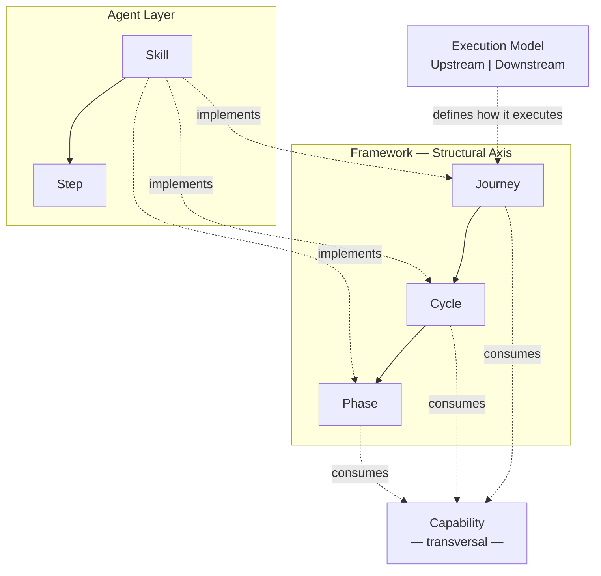

[Português](ontology.md)

# ProdOps Ontology

Canonical definitions of the structural concepts of the ProdOps Framework.

This document is the **single source of truth** for the concept hierarchy. Documents that describe these concepts should reference this document rather than redefine the terms.

→ For the complete vocabulary of terms, see [glossary.en.md](glossary.en.md).
→ For the operational model and workflow, see [operating-model.en.md](operating-model.en.md).

---

## Canonical diagram

**How to read the diagram:**

- The **structural axis** (inside the Framework) organizes work into three levels: Journey → Cycle → Phase.
- The **Execution Model** is a modifier — it defines how any Journey executes, not what it is.
- **Capability** is transversal — it can be consumed by a Phase, a Cycle, or an entire Journey.
- The **Agent Layer** (Skill → Step) is the executable implementation of the structural axis. It is not a Framework concept — it is an implementation convention.

---

## Structural axis: Framework → Journey → Cycle → Phase

### Framework

**What it is:** The canonical system of principles, vocabulary, operating model, journeys, capabilities, and templates that defines how ProdOps works. It is product-independent.

**Responsibility:** Be the single source of truth about how to work with ProdOps — regardless of which product, portfolio, or workspace adopts it.

**Abstraction level:** Meta-level. Defines the structure that all other levels (Portfolio, Workspace, Product Repository) adopt and extend.

**Contains:** Principles, glossary, official flow, Execution Model, the 5 journeys, capabilities, templates, Origin Streams.

**Never represents:** Roadmap, product backlogs, business intents, features, code, releases.

---

### Journey

**What it is:** A work path with a single responsibility, its own lifecycle, and defined entry and exit criteria.

**Responsibility:** Organize work by intent — the **what** — independently of the execution mode (the mode defines only the **how**).

**The 5 journeys:**

| Journey | Type | Responsibility |
|---|---|---|
| Discovery | Classic | Reduce uncertainty and prepare work |
| Delivery | Classic | Build, validate, and promote the solution |
| Operation | Classic | Operate and evolve the product in production |
| Assessment | Transversal | Produce analyses to support decisions |
| Diligence | Transversal | Ensure consistency of the work system |

**Contains:** One or more Cycles (or a fluid sequence of phases, for journeys without formal Cycles).

**Never represents:** An execution mode. Upstream and Downstream are not journeys.

→ [journeys/README.en.md](journeys/README.en.md)

---

### Cycle

**What it is:** An ordered grouping of Phases within a Journey, with distinct purpose, trigger, and nature.

**Responsibility:** Separate sets of Phases that have different operational nature within the same journey — for example, synchronous vs. asynchronous work, or reactive vs. proactive.

**Existing cycles:**

| Journey | Cycle | Nature |
|---|---|---|
| Delivery | CI Sync | Synchronous — local, engineer-driven work |
| Delivery | CI Async | Asynchronous — platform-driven work |
| Diligence | diligence-sync | Reactive — triggered by external event |
| Diligence | diligence-async | Proactive — initiated by periodic scan |
| Assessment | Assessment Sync | Structured — collect, analyze and synthesize on demand |
| Assessment | Assessment Async | Continuous — proactive monitoring and alerting |

**Note:** Discovery and Operation have no formal Cycles — they operate as fluid sequences of Phases or activities without explicit grouping. Workspace Reconciliation is a **Capability** of Diligence — not a Cycle. It is invoked by Bootstrap, Diligence Async, and Diligence Sync as a sub-routine.

**Never represents:** The Journey that contains it, an individual Phase, or a Capability.

---

### Phase

**What it is:** An individual, ordered stage within a Cycle, with defined entry preconditions, single responsibility, and verifiable exit postconditions.

**Responsibility:** Execute an atomic step within a Cycle. Each Phase produces a verifiable output that serves as input for the next Phase.

**Phases by Cycle:**

| Cycle | Phases |
|---|---|
| CI Sync | Bootstrap → Hack → Sync → Finish |
| CI Async | Ship → Validate → Promote |
| diligence-sync | Capture → Attach → Promote → Close |
| diligence-async | Scan → Flag → Repair |
| Assessment Sync | Collect → Analyze → Synthesize → Report |
| Assessment Async | Monitor → Alert |

**Abstraction level:** The smallest structural unit of the conceptual model. The implementation of a Phase belongs to the agent layer (Skill and Steps).

**Never represents:** A Journey, a Cycle, a Capability, or a product artifact.

> **Required distinction — Lifecycle Stage vs. Phase:**
>
> The document [`phases.en.md`](phases.en.md) describes **Conception** and **Inception** — lifecycle stages of a Business Intent *before* the Delivery journey. These are **Lifecycle Stages**, conceptually distinct from the Phases in this ontology (Bootstrap, Hack, Capture, Inspect, etc.). When ambiguity exists, use the explicit qualifier: "Lifecycle Stage", "Delivery Phase", or "Diligence Phase".

---

## Transversal modifier: Execution Model

### Execution Model

**What it is:** The pair of execution modes that defines the level of commitment, quality gates, and quality criteria applied when any Journey is executed — Upstream (exploration) and Downstream (commitment).

**Responsibility:** Define *how* a Journey executes, not *what* it is. The same work can be executed in Upstream mode (exploratory, without rigid gates) or Downstream mode (with all mandatory quality gates).

**Important:** The Execution Model is not a Journey. It is not between Journey and Cycle in the hierarchy — it is a modifier applied *over* any Journey.

> **Wrong:** "The item is in Upstream" as a synonym for "it is in Discovery."
> **Correct:** "The item is in Discovery, in Upstream mode."

**Contains:** Upstream (exploration mode), Downstream (commitment mode), mode transition rules.

→ [execution-model/README.en.md](execution-model/README.en.md)

---

## Transversal dimension: Capability

### Capability

**What it is:** A reusable competency that can be consumed by Journeys, Cycles, or Phases — without belonging exclusively to any of them.

**Responsibility:** Encapsulate a specific mechanism that multiple points of the Framework can invoke without duplicating its definition. A Capability defines *what* is done, not *when* or *by whom*.

**Transversal nature:** A Capability is not tied to a specific Journey. The same Capability can be consumed by Phases of different Cycles, by Cycles of different Journeys, or by an entire Journey. When new journeys or cycles are added to the Framework, they can consume existing Capabilities without changing the Capability's definition.

**Two categories:**

| Category | What it represents |
|---|---|
| **Framework Capability** | A mechanism of the ProdOps process — reusable at any point in the structure that requires it. Not associated with a specific product. |
| **Product Capability** | A feature, behavior, or characteristic of the product being explored or delivered. It is the *object* of work, not the mechanism. |

**Framework Capability groups by area of origin** (not of exclusive ownership):

- *Delivery area:* Commit Workflow, Contract Management, Evidence Management, Observability, Reliability
- *Diligence area:* Backlog Synchronization, Work Item Management, Readiness Verification, Divergence Detection, Artifact Evolution, Workspace Reconciliation

These groups are organized by where Capabilities were originally defined, not by a usage restriction. A Delivery Capability can be consumed by another Journey if relevant.

**Naming rule:** When there is ambiguity, use the full qualifier: "Framework Capability", "Delivery Capability", "Diligence Capability", or "Product Capability".

**Never represents:** A Phase, a Cycle, a Journey, or a Skill. Product Capability is not a Framework mechanism — it is the object of work.

→ [journeys/delivery/capabilities/](journeys/delivery/capabilities/) · [journeys/diligence/capabilities/](journeys/diligence/capabilities/)

---

## Implementation layer: Skill → Step

### Skill

**What it is:** A specification of executable behavior intended for agents. A Skill describes what an agent must do, when to enter, what to read, and what to produce — implementing a Journey, Cycle, Phase, or Capability.

**Responsibility:** Be the executable implementation of the structural axis for agents. It is the bridge between the Framework's conceptual model and the actual execution by an agent.

**A Skill is NOT a structural concept of the Framework.** The Framework defines *what* must happen (Journeys, Cycles, Phases, Capabilities). A Skill defines *how a specific agent executes* that what. Conceptual documentation lives in `journeys/`; executable Skills live in `skills/`.

**Technology independence:** The Framework does not depend on any specific technology for Skills to exist. A Skill can be executed by Claude, by Codex, by Copilot, by any other agent system, or by a future automation tool. The Skill format (Markdown file with structured fields) is an implementation convention — not a property of the Framework itself.

**Contains:** Steps (ordered, self-contained sub-units).

**Never represents:** Conceptual documentation, product template, artifact, Capability.

→ [skills/README.en.md](../skills/README.en.md)

---

### Step

**What it is:** An ordered sub-unit within a Skill, with its own input and output. A Step can be invoked individually when needed.

**Responsibility:** Implement a specific step within a Skill in a self-contained and isolated way — with its own preconditions and postconditions.

**Step is exclusively an internal structure of Skill.** There is no direct relationship between Step and any concept in the structural axis (Framework, Journey, Cycle, Phase, Capability). A Step is not a smaller Phase. A Step is not a Capability. Step belongs to the implementation layer — not to the conceptual model.

**Never represents:** A Phase, a Capability, a conceptual artifact, or a Framework concept.

---

## Product concept: Product Topology

### Product Topology

**What it is:** The permanent structural organization of a product. Describes the four dimensions that coexist in any product and over which OBCs produce changes via Delivery.

**Responsibility:** Identify which parts of the product structure are affected by an OBC — independent of where the intent originated (Origin Stream) and independent of the delivery process (Journeys, Cycles, Phases).

**The four Product Dimensions:**

| Dimension | What it describes |
|---|---|
| **Team** | Organizational dimension: ownership, responsibilities, capabilities, roles, governance, and operational model |
| **Flow** | Temporal axis: records how Team, Data, and Components evolve across the Framework journeys (Discovery, Delivery, Operation, Diligence) — does not execute, only represents evolution |
| **Data** | Informational dimension: entities, data contracts, schemas, persistence, domain events, and APIs |
| **Components** | Physical and behavioral dimension: services, APIs, databases, queues, infrastructure — implement the product's functional behavior |

**Required ontological separation:**

| Concept | Question it answers |
|---|---|
| **Origin Streams** | Where did this need come from? (origin of the intent) |
| **Product Topology** | Which parts of the product will be impacted? (permanent structure) |

Origin Streams and Product Topology are entirely distinct concepts. An OBC originating from any Origin Stream can impact any combination of Product Dimensions. The origin does not determine the impact.

**Never represents:** Backlog, journey, pipeline, work flow, or process lifecycle. Product Topology describes the structure of the product — not the process of building the product.

→ [product-topology.en.md](product-topology.en.md)

---

## Relationships between all concepts

| Relationship | Statement |
|---|---|
| Framework **defines** → Journey | The Framework specifies the 5 journeys; Journeys do not exist outside the Framework |
| Execution Model **modifies** → Journey | The mode defines *how* the Journey executes; it is not the Journey and is not between it and its Cycles |
| Journey **contains** → Cycle | A Journey has one or more Cycles (or direct Phases) |
| Cycle **contains** → Phase | A Cycle is the ordered sequence of its Phases |
| Journey/Cycle/Phase **consumes** → Capability | Capabilities are invoked at any level that needs them |
| Skill **implements** → Journey / Cycle / Phase | A Skill is the executable specification of a level in the structural axis |
| Skill **contains** → Step | Steps are internal sub-units of a Skill |
| Capability **≠** Skill | Capability is a conceptual Framework mechanism; Skill is an executable specification for agents |
| Step **≠** Phase | Step is internal implementation structure; Phase is a structural Framework concept |

---

## Disambiguation notes

### Formal cycles vs. fluid journeys

Not every Journey has formal Cycles. Delivery, Diligence, and Assessment have explicit Cycles with names and distinct responsibilities. Discovery and Operation operate more fluidly — they have activities and practices, but without formal grouping into named Cycles.

### "Grouping" vs. "Cycle"

Some earlier ProdOps documents use the term "grouping" (agrupamento) for CI Sync and CI Async. The canonical term is **Cycle**. Grouping is informal description; Cycle is the formal concept of this ontology.

### OBC Partitioning is not a Capability

Some documents reference "OBC Partitioning" as a "capability". In the ProdOps ontology, OBC Partitioning is a **governance process** (owned by Portfolio PM + Tech Leads) executed between Discovery in the BIB and the creation of Local OBCs in Product Backlogs. It is neither a Framework Capability nor a Product Capability. See [obc.en.md](obc.en.md).

---

## Canonical source

This document is the single source of truth for the ProdOps concept hierarchy.

| Document | Role relative to this ontology |
|---|---|
| [glossary.en.md](glossary.en.md) | Lexical definitions of all terms — references this ontology for hierarchy |
| [operating-model.en.md](operating-model.en.md) | Operating model and flow — references this ontology for structural concepts |
| [execution-model/README.en.md](execution-model/README.en.md) | Details Upstream and Downstream — is a specialization of this ontology |
| [journeys/README.en.md](journeys/README.en.md) | Details each Journey — references Cycle and Phase from this ontology |
| [skills/README.en.md](../skills/README.en.md) | Skills catalog — references this ontology for Skill and Step positioning |
| [product-topology.en.md](product-topology.en.md) | Details the four Product Dimensions and the OBC → Product Topology relationship |
