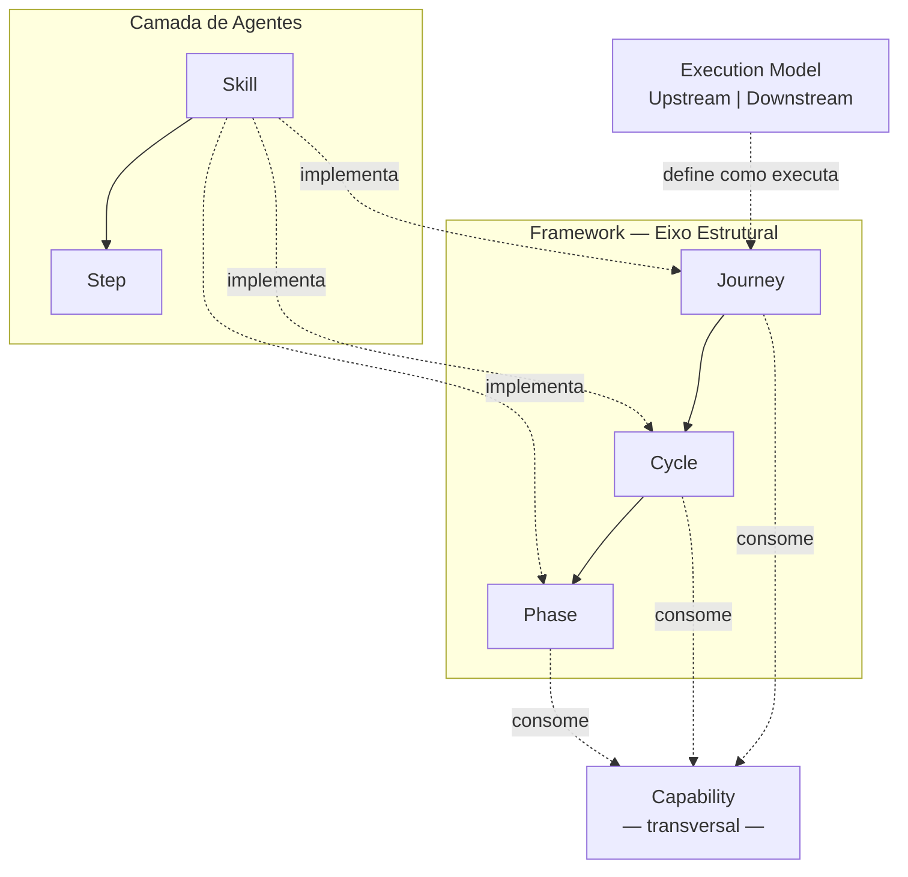

[English](ontology.en.md)

# ProdOps Ontology

Definição canônica dos conceitos estruturais do Framework ProdOps.

Este documento é a **fonte única de verdade** para a hierarquia de conceitos. Documentos que descrevem esses conceitos devem referenciar este documento em vez de redefinir os termos.

→ Para o vocabulário completo dos termos, ver [glossary.md](glossary.md).
→ Para o modelo operacional e o fluxo de trabalho, ver [operating-model.md](operating-model.md).

---

## Diagrama canônico

**Leitura do diagrama:**

- O **eixo estrutural** (dentro do Framework) organiza o trabalho em três níveis: Journey → Cycle → Phase.
- O **Execution Model** é um modificador — define como qualquer Journey executa, não o que ela é.
- A **Capability** é transversal — pode ser consumida por uma Phase, um Cycle ou uma Journey inteira.
- A **Camada de Agentes** (Skill → Step) é a implementação executável do eixo estrutural. Não é um conceito do Framework — é uma convenção de implementação.

---

## Eixo estrutural: Framework → Journey → Cycle → Phase

### Framework

**O que é:** O sistema canônico de princípios, vocabulário, modelo operacional, jornadas, capabilities e templates que define como o ProdOps funciona. É independente de produto.

**Responsabilidade:** Ser a fonte única de verdade sobre como trabalhar com ProdOps — independente de qual produto, portfolio ou workspace o adota.

**Nível de abstração:** Meta-nível. Define a estrutura que todos os outros níveis (Portfolio, Workspace, Product Repository) adotam e estendem.

**Contém:** Princípios, glossário, fluxo oficial, Execution Model, as 5 jornadas, capabilities, templates, Origin Streams.

**Nunca representa:** Roadmap, Backlogs de produto, Business Intents, Features, código, Releases.

---

### Journey (Jornada)

**O que é:** Um caminho de trabalho com responsabilidade única, ciclo de vida próprio e critérios de entrada e saída definidos.

**Responsabilidade:** Organizar o trabalho por intenção — o **que** está sendo feito — independente do modo de execução (o modo define apenas o **como**).

**As 5 jornadas:**

| Jornada | Tipo | Responsabilidade |
|---|---|---|
| Discovery | Clássica | Reduzir incerteza e preparar o trabalho |
| Delivery | Clássica | Construir, validar e promover a solução |
| Operation | Clássica | Operar e evoluir o produto em produção |
| Assessment | Transversal | Produzir análises para apoiar decisões |
| Diligence | Transversal | Garantir consistência do sistema de trabalho |

**Contém:** Um ou mais Cycles (ou uma sequência fluida de phases, nas jornadas sem Cycles formais).

**Nunca representa:** Um modo de execução. Upstream e Downstream não são jornadas.

→ [journeys/README.md](journeys/README.md)

---

### Cycle (Ciclo)

**O que é:** Um agrupamento ordenado de Phases dentro de uma Journey, com propósito, acionamento e natureza distintos.

**Responsabilidade:** Separar conjuntos de Phases que têm natureza operacional diferente dentro da mesma jornada — por exemplo, trabalho síncrono vs. assíncrono, ou reativo vs. proativo.

**Ciclos existentes:**

| Journey | Cycle | Natureza |
|---|---|---|
| Delivery | CI Sync | Síncrono — trabalho local, conduzido pelo engenheiro |
| Delivery | CI Async | Assíncrono — trabalho conduzido pela plataforma |
| Diligence | diligence-sync | Reativo — acionado por evento externo |
| Diligence | diligence-async | Proativo — iniciado por varredura periódica |
| Assessment | Assessment Sync | Estruturado — coleta, análise e síntese por demanda |
| Assessment | Assessment Async | Contínuo — monitoramento e alerta proativo |

**Nota:** Discovery e Operation não têm Cycles formais — operam como sequências fluidas de Phases ou de atividades sem agrupamento explícito. Workspace Reconciliation é uma **Capability** do Diligence — não é um Cycle. É invocada por Bootstrap, Diligence Async e Diligence Sync como sub-rotina. Ver seção Capability abaixo.

**Nunca representa:** A Journey que o contém, uma Phase individual, uma Capability.

---

### Phase (Fase)

**O que é:** Um estágio individual e ordenado dentro de um Cycle, com pré-condições de entrada, responsabilidade única e pós-condições de saída verificáveis.

**Responsabilidade:** Executar uma etapa atômica dentro de um Cycle. Cada Phase produz uma saída verificável que serve de entrada para a Phase seguinte.

**Phases por Cycle:**

| Cycle | Phases |
|---|---|
| CI Sync | Bootstrap → Hack → Sync → Finish |
| CI Async | Ship → Validate → Promote |
| diligence-sync | Capture → Attach → Promote → Close |
| diligence-async | Scan → Flag → Repair |
| Assessment Sync | Collect → Analyze → Synthesize → Report |
| Assessment Async | Monitor → Alert |

**Nível de abstração:** A menor unidade estrutural do modelo conceitual. A implementação de uma Phase pertence à camada de agentes (Skill e Steps).

**Nunca representa:** Uma Journey, um Cycle, uma Capability, um artefato de produto.

> **Distinção obrigatória — Lifecycle Stage vs. Phase:**
>
> O documento [`phases.md`](phases.md) descreve **Concepção** e **Inception** — estágios do ciclo de vida de uma Business Intent *antes* da jornada Delivery. Esses são **Lifecycle Stages**, conceitualmente distintos das Phases desta ontologia (Bootstrap, Hack, Capture, Inspect, etc.). Quando houver ambiguidade, usar o qualificador explícito: "Lifecycle Stage", "Delivery Phase" ou "Diligence Phase".

---

## Modificador transversal: Execution Model

### Execution Model

**O que é:** O par de modos de execução que define o nível de compromisso, os quality gates e os critérios de qualidade aplicados quando qualquer Journey é executada — Upstream (exploração) e Downstream (compromisso).

**Responsabilidade:** Definir *como* uma Journey executa, não *o que* ela é. O mesmo trabalho pode ser executado em modo Upstream (exploratório, sem gates rígidos) ou Downstream (com todos os quality gates obrigatórios).

**Importante:** Execution Model não é uma Journey. Não está entre Journey e Cycle na hierarquia — é um modificador aplicado *sobre* qualquer Journey.

> **Errado:** "O item está no Upstream" como sinônimo de "está em Discovery".
> **Correto:** "O item está em Discovery, no modo Upstream."

**Contém:** Upstream (modo de exploração), Downstream (modo de compromisso), regras de transição entre modos.

→ [execution-model/README.md](execution-model/README.md)

---

## Dimensão transversal: Capability

### Capability

**O que é:** Uma competência reutilizável que pode ser consumida por Journeys, Cycles ou Phases — sem pertencer exclusivamente a nenhum deles.

**Responsabilidade:** Encapsular um mecanismo específico que múltiplos pontos do Framework podem invocar sem duplicar a sua definição. Uma Capability define *o que* é feito, não *quando* nem *por quem*.

**Natureza transversal:** Uma Capability não está atrelada a uma Journey específica. A mesma Capability pode ser consumida por Phases de diferentes Cycles, por Cycles de diferentes Journeys, ou por uma Journey inteira. Quando novas jornadas ou ciclos são adicionados ao Framework, eles podem consumir Capabilities existentes sem alterar a definição delas.

**Duas categorias:**

| Categoria | O que representa |
|---|---|
| **Framework Capability** | Mecanismo do processo ProdOps — reutilizável em qualquer ponto da estrutura que o necessite. Não está associada a um produto específico. |
| **Product Capability** | Uma funcionalidade, comportamento ou característica do produto que está sendo explorada ou entregue. É o *objeto* do trabalho, não o mecanismo. |

**Grupos de Framework Capabilities por área de origem** (não de propriedade exclusiva):

- *Área Delivery:* Commit Workflow, Contract Management, Evidence Management, Observability, Reliability
- *Área Diligence:* Backlog Synchronization, Work Item Management, Readiness Verification, Divergence Detection, Artifact Evolution, Workspace Reconciliation

Esses grupos são organizados por onde as Capabilities foram originalmente definidas, não por uma restrição de uso. Uma Capability de Delivery pode ser consumida por outra Journey se ela for relevante.

**Regra de nomenclatura:** Quando houver ambiguidade, usar o qualificador completo: "Framework Capability", "Delivery Capability", "Diligence Capability" ou "Product Capability".

**Nunca representa:** Uma Phase, um Cycle, uma Journey ou uma Skill. Product Capability não é um mecanismo do Framework — é o objeto do trabalho.

→ [journeys/delivery/capabilities/](journeys/delivery/capabilities/) · [journeys/diligence/capabilities/](journeys/diligence/capabilities/)

---

## Camada de implementação: Skill → Step

### Skill

**O que é:** Uma especificação de comportamento executável destinada a agentes. Uma Skill descreve o que um agente deve fazer, quando entrar, o que ler e o que produzir — implementando uma Journey, um Cycle, uma Phase ou uma Capability.

**Responsabilidade:** Ser a implementação executável do eixo estrutural para agentes. É a ponte entre o modelo conceitual do Framework e a execução real por um agente.

**Skill NÃO é um conceito estrutural do Framework.** O Framework define o *que* deve acontecer (Journeys, Cycles, Phases, Capabilities). A Skill define *como um agente específico executa* esse o que. A documentação conceitual vive em `journeys/`; a Skill executável vive em `skills/`.

**Independência tecnológica:** O Framework não depende de nenhuma tecnologia específica para que Skills existam. Uma Skill pode ser executada por Claude, por Codex, por Copilot, por qualquer outro sistema de agente, ou por uma ferramenta de automação futura. O formato de Skill (arquivo Markdown com campos estruturados) é uma convenção de implementação — não uma propriedade do Framework em si.

**Contém:** Steps (sub-unidades ordenadas e autossuficientes).

**Nunca representa:** Documentação conceitual, template de produto, artefato, Capability.

→ [skills/README.md](../skills/README.md)

---

### Step

**O que é:** Sub-unidade ordenada dentro de uma Skill, com entrada e saída próprias. Um Step pode ser invocado individualmente quando necessário.

**Responsabilidade:** Implementar uma etapa específica dentro de uma Skill de forma autossuficiente e isolada — com suas próprias pré-condições e pós-condições.

**Step é exclusivamente uma estrutura interna de Skill.** Não há relação direta entre Step e qualquer conceito do eixo estrutural (Framework, Journey, Cycle, Phase, Capability). Um Step não é uma Phase menor. Um Step não é uma Capability. Step pertence à camada de implementação — não ao modelo conceitual.

**Nunca representa:** Uma Phase, uma Capability, um artefato conceitual, um conceito do Framework.

---

## Conceito de produto: Product Topology

### Product Topology

**O que é:** A organização estrutural permanente de um produto. Descreve as quatro dimensões que coexistem em qualquer produto e sobre as quais os OBCs produzem mudanças via Delivery.

**Responsabilidade:** Identificar quais partes da estrutura do produto são afetadas por um OBC — independente de onde a intenção nasceu (Origin Stream) e independente do processo de entrega (Journeys, Cycles, Phases).

**As quatro Product Dimensions:**

| Dimensão | O que descreve |
|---|---|
| **Team** | Dimensão organizacional: ownership, responsabilidades, capacidades, papéis, governança e modelo operacional |
| **Flow** | Eixo temporal: registra como Team, Data e Components evoluem pelas jornadas do Framework (Discovery, Delivery, Operation, Diligence) — não executa, apenas representa a evolução |
| **Data** | Dimensão informacional: entidades, contratos de dados, schemas, persistência, eventos de domínio e APIs |
| **Components** | Dimensão física e comportamental: serviços, APIs, bancos de dados, filas, infraestrutura — implementam o comportamento funcional do produto |

**Separação ontológica obrigatória:**

| Conceito | Pergunta que responde |
|---|---|
| **Origin Streams** | De onde surgiu esta necessidade? (origem da intenção) |
| **Product Topology** | Quais partes do produto serão impactadas? (estrutura permanente) |

Origin Streams e Product Topology são conceitos completamente distintos. Um OBC com origem em qualquer Origin Stream pode impactar qualquer combinação de Product Dimensions. A origem não determina o impacto.

**Nunca representa:** Backlog, jornada, pipeline, fluxo de trabalho, ciclo de vida do processo. Product Topology descreve a estrutura do produto — não o processo de construção do produto.

→ [product-topology.md](product-topology.md)

---

## Relações entre todos os conceitos

| Relação | Enunciado |
|---|---|
| Framework **define** → Journey | O Framework especifica as 5 jornadas; Journeys não existem fora do Framework |
| Execution Model **modifica** → Journey | O modo define *como* a Journey executa; não é a Journey nem está entre ela e seus Cycles |
| Journey **contém** → Cycle | Uma Journey tem um ou mais Cycles (ou Phases diretas) |
| Cycle **contém** → Phase | Um Cycle é a sequência ordenada de suas Phases |
| Journey/Cycle/Phase **consome** → Capability | Capabilities são invocadas em qualquer nível que as necessite |
| Skill **implementa** → Journey / Cycle / Phase | Uma Skill é a especificação executável de um nível do eixo estrutural |
| Skill **contém** → Step | Steps são sub-unidades internas de uma Skill |
| Capability **≠** Skill | Capability é um mecanismo conceitual do Framework; Skill é especificação executável para agentes |
| Step **≠** Phase | Step é estrutura interna de implementação; Phase é conceito estrutural do Framework |

---

## Notas de distinção

### Ciclos formais vs. jornadas fluidas

Nem toda Journey tem Cycles formais. Delivery, Diligence e Assessment têm Cycles explícitos com nomes e responsabilidades distintas. Discovery e Operation operam de forma mais fluida — têm atividades e práticas, mas sem agrupamento formal em Cycles nomeados.

### "Agrupamento" vs. "Cycle"

Alguns documentos ProdOps anteriores usam o termo "agrupamento" para CI Sync e CI Async. O termo canônico é **Cycle**. Agrupamento é descrição informal; Cycle é o conceito formal desta ontologia.

### OBC Partitioning não é uma Capability

Alguns documentos referenciam "OBC Partitioning" como "capability". Na ontologia ProdOps, OBC Partitioning é um **processo de governança** (responsabilidade do Portfolio PM + Tech Leads) executado entre Discovery no BIB e a criação de Local OBCs nos Product Backlogs. Não é uma Framework Capability nem uma Product Capability. Ver [obc.md](obc.md).

---

## Fonte canônica

Este documento é a fonte única de verdade da hierarquia de conceitos ProdOps.

| Documento | Papel em relação a esta ontologia |
|---|---|
| [glossary.md](glossary.md) | Definições lexicais de todos os termos — referencia esta ontologia para hierarquia |
| [operating-model.md](operating-model.md) | Modelo operacional e fluxo — referencia esta ontologia para os conceitos estruturais |
| [execution-model/README.md](execution-model/README.md) | Detalha Upstream e Downstream — é uma especialização desta ontologia |
| [journeys/README.md](journeys/README.md) | Detalha cada Journey — referencia Cycle e Phase desta ontologia |
| [skills/README.md](../skills/README.md) | Catálogo de Skills — referencia esta ontologia para o posicionamento de Skill e Step |
| [product-topology.md](product-topology.md) | Detalha as quatro Product Dimensions e o relacionamento OBC → Product Topology |
